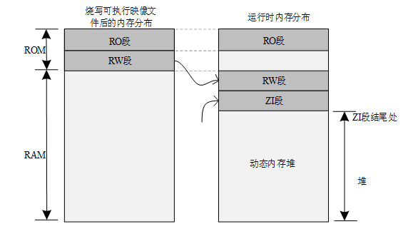

## 简述堆空间和栈空间
堆和栈是单片机两个不同地方的内存空间<p>
栈（stack）：由编译器自动分配和释放<p>
堆（heap）：一般由程序员分配和释放

```C
int a=0; //全局初始化区
char *p1; //全局未初始化区
int main(){
    int b;  //栈
    char s[] = "abc"; //栈
    char *p2;   //栈
    char *p3 = "123456";    //12345\0在常量区，p3在栈上
    static int c = 0;   //全局（静态）初始化区
    p1 = (char*) malloc(10);    //堆
    p2 = (char*) malloc(20);    //堆
    return 0;
}
```

## MDK裸机系统动态内存配置和使用 （无RT-Thread） 

STM32启动文件 startup_stm32f103xe.s分配了系统的栈空间和堆空间的地址和大小。

```asm

Stack_Size      EQU     0x00000400

                AREA    STACK, NOINIT, READWRITE, ALIGN=3
Stack_Mem       SPACE   Stack_Size
__initial_sp
                                                  
; <h> Heap Configuration
;   <o>  Heap Size (in Bytes) <0x0-0xFFFFFFFF:8>
; </h>

Heap_Size       EQU     0x00000200

                AREA    HEAP, NOINIT, READWRITE, ALIGN=3
__heap_base
Heap_Mem        SPACE   Heap_Size
__heap_limit

```

然后在程序中书写下述代码，即可分配释放动态内存
```C
char *p;
/*动态内存分配*/
p = (char*)malloc(10);
/*释放*/
free(p);
```

## RT-Thread 动态内存配置和使用

board.c 中`rt_hw_board_init(void)` 进行初始化时， `rt_system_heap_init((void *)HEAP_BEGIN, (void *)HEAP_END)`分配了**堆空间**/`heap`。
```C
void rt_hw_board_init(void)
{
    HAL_Init();
    SystemClock_Config();
#ifdef RT_USING_HEAP
		//配置动态内存
        //给定起始地址和结束地址
    rt_system_heap_init((void *)HEAP_BEGIN, (void *)HEAP_END);
#endif
#ifdef RT_USING_COMPONENTS_INIT
    rt_components_board_init();
#endif
#ifdef RT_USING_CONSOLE
    rt_console_set_device(RT_CONSOLE_DEVICE_NAME);
#endif
}
```
我们可以进入 `rt_system_heap_init((void *)HEAP_BEGIN, (void *)HEAP_END)`查看分配的流程。下面我们查看一下默认的起始地址和结束地址。

- 起始地址采用程序`ZI`段的结束地址，也就是程序执行区域的RAM结束后的地址。

- 结束地址采用STM32的`SRAM`的结束地址。

- Total RW + heap size = MCU total RAM size

这样我们就能最大化利用`RAM`的空闲空间

如果我们要修改`heap`/堆空间，我们只需要修改起始地址和结束地址就可以。比如在有内存拓展坞的情况。
```C
#define HEAP_BEGIN  ((void *)&Image$$RW_IRAM1$$ZI$$Limit)

#define HEAP_END    STM32_SRAM_END
```

在RT-Thread中，我们用`rt_malloc()`和`rt_free()`来分配和释放内存，与裸机的`malloc()`和`free()`一一对应。

> 程序内存分布图<p>
1）Code：代码段，存放程序的代码部分；<p>
2）RO-data：只读数据段，存放程序中定义的常量；<p>
3）RW-data：读写数据段，存放初始化为非 0 值的全局变量；<p>
4）ZI-data：0 数据段，存放未初始化的全局变量及初始化为 0 的变量；<p>



## 示例代码 `rt_malloc()`和`rt_free()`的使用<p>参考`./kernel-sample/dynmen_sample.c`

- `void *rt_malloc(rt_size_t size)` <p>
动态内存分配函数，返回指向内存空间地址的指针，`size`为所要分配的内存大小。

- `void rt_free(void *rmem)`<p> 
动态内存释放函数，`*rmem`为指向所要释放内存的指针。


## 动态内存堆使用注意力点
- **内存复位**：当我们每次申请到新的内存块后，要对所申请到的内存块进行**清零操作/复位**。

```C
char *p = RT_NULL;
p = rt_malloc(10);
if(p != RT_NULL ){
    rt_memset(p,0,10);  //清零操作
}
rt_free(p);
// rt_memset(void *s, int c, rt_ubase_t count)
// 指向内存的指针 赋值为何 赋值区域大小
```

- **内存泄漏**（Memory Leak）是指程序中以动态分配的堆内存由于某种原因程序未释放或无法释放，造成系统内存的浪费，导致程序中运行速度减慢甚至系统崩溃等严重后果。我们一定要`rt_malloc`和`rt_free`配套使用。


## 其他动态内存相关API

- `void *rt_realloc(void *rmem, rt_size_t newsize)`<p>
在已经分配内存块的基础上重新分配内存块的大小（增加或者缩小）,`newsize`是新的内存块大小。在重新分配内存块的时候，原来的内存块数据保持不变（缩小的情况下，后面的数据被自动截断）。所以**内存复位**很重要。

- `void *rt_calloc(rt_size_t count, rt_size_t size)`<p>
从内存堆中分配连续内存地址的多个内存块，数目为`count`，单个大小为`size`。返回指向申请的第一个内存块的地址的指针，并且申请的所有内存块都会清零。

```C
// 返回的指针类型是 void *，可以强制转换为任何类型的指针。
void *rt_calloc(rt_size_t count, rt_size_t size)
{
    void *p;

    RT_DEBUG_NOT_IN_INTERRUPT;

    /* allocate 'count' objects of size 'size' */
    p = rt_malloc(count * size);

    /* zero the memory */
    if (p)
        rt_memset(p, 0, count * size);

    return p;
}
RTM_EXPORT(rt_calloc);
```


```C
void *p = rt_malloc(sizeof(int)); // 分配一个 int 大小的内存
	if (p != NULL) {
		*(int *)p = 100; // 将 void * 转换为 int *，然后存储数据
		int data = *(int *)p; // 获取指针指向地址中的数据
		rt_kprintf("Data: %d\n", data); // 输出: Data: 100
		rt_free(p); // 释放内存
	}
	
	p = rt_calloc(3,sizeof(int)); // 分配一个 int 大小的内存 都存放0
	if (p != NULL) {
		int *p1 = (int*) p; // 要从void转成int才能加减
		int data = *p1; // 获取指针指向地址中的数据
		rt_kprintf("Data1: %d, Address: %p \n", data, p1); // 输出: Data1: 0 Address: 20005d38
		p1++;
		data = *p1;
		rt_kprintf("Data2: %d, Address: %p \n",data, p1);	//输出 Data2: 0, Address: 20005d3c
		rt_free(p); // 释放内存
	}
```


## 补充：RT-Thread 程序内存分布
参考链接

一般 MCU 包含的存储空间有：片内 Flash 与片内 RAM，RAM 相当于内存，Flash 相当于硬盘。编译器会将一个程序分类为好几个部分，分别存储在 MCU 不同的存储区。

Keil 工程在编译完之后，会有相应的程序所占用的空间提示信息，如下所示：

```
linking...
Program Size: Code=48008 RO-data=5660 RW-data=604 ZI-data=2124
After Build - User command \#1: fromelf --bin.\\build\\rtthread-stm32.axf--output rtthread.bin
".\\build\\rtthread-stm32.axf" - 0 Error(s), 0 Warning(s).
Build Time Elapsed: 00:00:07
```

上面提到的 Program Size 包含以下几个部分：

1）Code：代码段，存放程序的代码部分；

2）RO-data：只读数据段，存放程序中定义的常量；

3）RW-data：读写数据段，存放初始化为非 0 值的全局变量；

4）ZI-data：0 数据段，存放未初始化的全局变量及初始化为 0 的变量；

编译完工程会生成一个`.map` 的文件，该文件说明了各个函数占用的尺寸和地址，在文件的最后几行也说明了上面几个字段的关系：

```
Total RO Size (Code + RO Data) 53668 ( 52.41kB)
Total RW Size (RW Data + ZI Data) 2728 ( 2.66kB)
Total ROM Size (Code + RO Data + RW Data) 53780 ( 52.52kB)
```

1）RO Size 包含了 Code 及 RO-data，表示程序占用 Flash 空间的大小；

2）RW Size 包含了 RW-data 及 ZI-data，表示运行时占用的 RAM 的大小；

3）ROM Size 包含了 Code、RO-data 以及 RW-data，表示烧写程序所占用的 Flash 空间的大小；

程序运行之前，需要有文件实体被烧录到 STM32 的 Flash 中，一般是 bin 或者 hex 文件，该被烧录文件称为可执行映像文件。如下图左边部分所示，是可执行映像文件烧录到 STM32 后的内存分布，它包含 RO 段和 RW 段两个部分：其中 RO 段中保存了 Code、RO-data 的数据，RW 段保存了 RW-data 的数据，由于 ZI-data 都是 0，所以未包含在映像文件中。

STM32 在上电启动之后默认从 Flash 启动，启动之后会将 RW 段中的 RW-data（初始化的全局变量）搬运到 RAM 中，但不会搬运 RO 段，即 CPU 的执行代码从 Flash 中读取，另外根据编译器给出的 ZI 地址和大小分配出 ZI 段，并将这块 RAM 区域清零。


其中动态内存堆为未使用的 RAM 空间，应用程序申请和释放的内存块都来自该空间。

如下面的例子：

```c
rt_uint8_t* msg_ptr;
msg_ptr = (rt_uint8_t*) rt_malloc (128);
rt_memset(msg_ptr, 0, 128);
```

代码中的 msg_ptr 指针指向的 128 字节内存空间位于动态内存堆空间中。

而一些全局变量则是存放于 RW 段和 ZI 段中，RW 段存放的是具有初始值的全局变量（而常量形式的全局变量则放置在 RO 段中，是只读属性的），ZI 段存放的系统未初始化的全局变量，如下面的例子：

```c
#include <rtthread.h>

const static rt_uint32_t sensor_enable = 0x000000FE;
rt_uint32_t sensor_value;
rt_bool_t sensor_inited = RT_FALSE;

void sensor_init()
{
     /* ... */
}
```

sensor_value 存放在 ZI 段中，系统启动后会自动初始化成零（由用户程序或编译器提供的一些库函数初始化成零）。sensor_inited 变量则存放在 RW 段中，而 sensor_enable 存放在 RO 段中。


