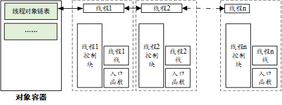
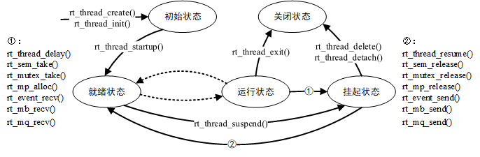
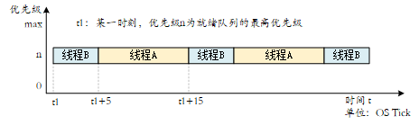

## 进程（Process）和线程（Thread）的概念

计算机系统中有进程（Process）和线程（Thread）两个概念。

| |进程（Process）|线程（Thread）
-----|----|----
定义|资源分配的基本单位|调度的最小单位，进程内的一个执行单元
内存空间|独立的内存空间、文件描述符、环境变量等资源|共享进程的内存空间和资源
资源开销|创建、销毁和切换开销较大|创建、销毁和切换开销较小
通信方式|进程间通信需要操作系统支持（比如管道、消息队列、共享内存等）|线程间可以直接访问共享数据
稳定性|进程崩溃不会影响其他进程|线程崩溃可能导致整个进程崩溃
并发性|OK|OK
同步机制|不需要（因为内存独立）|需要同步机制（如互斥锁、信号量）来避免竞争

#### 进程的应用场景
- 需要高隔离型的任务（不同的应用程序）
- 需要独立内存空间的任务（多个独立的服务）
- 需要高稳定性的任务（一个进程崩溃不会影响其他进程）

#### 线程的应用场景
- 需要高效共享数据的任务（多线程服务器）
- 需要轻量级并发的任务（GUI/图形用户界面 应用程序中的后台任务）
- 需要频繁创建和销毁的任务（线程开销较小）


# RT-Thread 实时线程RTOS

由于嵌入式系统内存较少的特点，RTOS（实时操作系统）一般采用单进程多线程的设计。RT-Thread就是一个典型。

RT-Thread 线程管理的主要功能是对线程进行管理和调度，系统中总共存在两类线程，分别是系统线程和用户线程，系统线程是由 RT-Thread 内核创建的线程，用户线程是由应用程序创建的线程，这两类线程都会从内核对象容器中分配线程对象，当线程被删除时，也会被从对象容器中删除。

RT-Thread 的线程调度器是**抢占式**的，主要的工作就是从就绪线程列表中查找最高优先级线程，保证最高优先级的线程能够被运行，最高优先级的任务一旦就绪，总能得到 CPU 的使用权。

当一个运行着的线程使一个比它优先级高的线程满足运行条件，当前线程的 CPU 使用权就被剥夺了，或者说**让出**了，高优先级的线程立刻得到了 CPU 的使用权。

> 注：这个满足运行条件 即 高优先级的线程处于**就绪态**（不能是挂起态）。

如果是**中断服务程序**使一个高优先级的线程满足运行条件，中断完成时，被中断的线程挂起，优先级高的线程开始运行。

当调度器调度线程切换时，先将当前线程上下文保存起来，当再切回到这个线程时，线程调度器将该线程的上下文信息恢复。


## 线程组成

如下图所示，在RT-Thread中，线程由三个部分组成：
**线程代码（入口函数）**、**线程控制块**、**线程堆栈**。




#### 线程代码（入口函数）
线程控制块中的 entry 是线程的入口函数，它是线程实现预期功能的函数。线程的入口函数由用户设计实现，一般有以下两种代码形式：

> 说人话：就是我们用户具体要干的事情 

- 无线循环结构（目的是为了让这个线程一直被系统循环调度运行，永不删除）
```C
void thread_entry(void *parameter)
{
    while(1)
    {
        /*等待事件发生*/
        /*让出CPU的使用权 避免死循环*/
        /*调用延时函数或者主动挂起*/
        ---
        /*处理事件*/
    }

}
```

- 顺序执行结构（“一次性”线程，用完就被系统删除，做些简单的工作）
```C
void thread_entry(void *parameter)
{
    /*处理事务1*/
    /*处理事务2*/
    ---
    /*处理事务N*/
}
```
#### 线程控制块（Thread Control Block, TCB）

线程控制块是操作系统用于管理线程的核心`数据结构`，它会存放线程的所有元信息，例如优先级、线程名称、线程状态等，也包括线程与线程之间连接用的链表结构，线程等待事件集合等，以及寄存器状态、栈指针、程序计数器（PC）等。

RT-Thread中线程控制块是由
`struct rt_thread{---};`和 `typedef struct rt_thread *rt_thread_t;` 来定义。具体查看`rtdef.h`。

```C
/**
 * Thread structure
 */
/* 线程控制块 */
struct rt_thread
{
    /* rt 对象 */
    char        name[RT_NAME_MAX];     /* 线程名称 */
    rt_uint8_t  type;                   /* 对象类型 */
    rt_uint8_t  flags;                  /* 标志位 */

    rt_list_t   list;                   /* 对象列表 */
    rt_list_t   tlist;                  /* 线程列表 */

    /* 栈指针与入口指针 */
    void       *sp;                      /* 栈指针 */
    void       *entry;                   /* 入口函数指针 */
    void       *parameter;              /* 参数 */
    void       *stack_addr;             /* 栈地址指针 */
    rt_uint32_t stack_size;            /* 栈大小 */

    /* 错误代码 */
    rt_err_t    error;                  /* 线程错误代码 */
    rt_uint8_t  stat;                   /* 线程状态 */

    /* 优先级 */
    rt_uint8_t  current_priority;    /* 当前优先级 */
    rt_uint8_t  init_priority;        /* 初始优先级 */
    rt_uint32_t number_mask;

    ......

    rt_ubase_t  init_tick;               /* 线程初始化计数值 */
    rt_ubase_t  remaining_tick;         /* 线程剩余计数值 */

    struct rt_timer thread_timer;      /* 内置线程定时器 */

    void (*cleanup)(struct rt_thread *tid);  /* 线程退出清除函数 */
    rt_uint32_t user_data;                      /* 用户数据 */
};
/* point to struct rt_thread */
/* 用来指向结构体 */
typedef struct rt_thread *rt_thread_t;
```


#### 线程栈

在RT-Thread中，**线程栈**是线程运行时用来存储局部变量、函数调用信息等的内存空间。简单来说，每个线程都有自己的“工作区”，这个工作区就是**线程栈**。

RT-Thread中每个线程都有独立的栈，当进行线程切换时，系统会将当前`线程的上下文`（线程执行时的环境，有各种变量和数据包括寄存器变量、堆栈信息、内存信息、函数调用、局部变量等）保存在**线程栈**中，当线程要恢复运行时，再从线程栈中读取上下文信息，恢复线程的运行。

> 注：栈是线程的私有空间，不同线程的栈互不干扰。<p>
线程栈≠线程所拥有的内存空间 

**线程栈**在形式上是一段连续的内存空间，我们可以定义一个数组或者申请一段动态内存来作为线程的栈。

即**线程栈**可以是静态分配的（固定大小），也可以是动态分配的（运行时从堆/heap中分配）。

> 为了避免线程栈占用太多内存空间，实际操作中，我们在初始时设置较大的栈，例如指定大小为 1K 或 2K 字节，然后在 FinSH 中用 `list_thread` 命令查看线程运行的过程中线程所使用的栈的大小。通过此命令，我们能够看到从线程启动运行时，到当前时刻点，线程使用的最大栈深度。而后加上适当的余量形成最终的线程栈大小，最后对线程栈空间大小（`stack size`）加以修改。一般将线程栈最大使用量（`max used`）设置为 `70%` 即可。

```rust
thread   pri  status      sp     stack size max used left tick   error  tcb addr
-------- ---  ------- ---------- ----------  ------  ---------- ------- ----------
tshell    20  running 0x000000a4 0x00001000    14%   0x00000007 OK      0x20001cd0
tidle0    31  ready   0x00000064 0x00000400    09%   0x0000001d OK      0x200006e8
main      10  suspend 0x000000a4 0x00000800    12%   0x00000013 EINTRPT 0x200011f0
```


## 创建和删除线程（针对动态线程）
**`rt_thread_create()`和`rt_thread_delete()`**

### 创建动态线程

```C
rt_thread_t rt_thread_create(
    const char* name,
    void (*entry)(void* parameter),
    void* parameter,
    rt_uint32_t stack_size,
    rt_uint8_t priority,
    rt_uint32_t tick
);
```
调用这个函数时，系统会从**动态堆内存**中分配一个线程句柄（线程控制块指针）以及按照参数中指定的`栈大小`从动态堆内存中分配相应的空间。分配出来的栈的空间是按照 `rtconfig.h` 中配置的 `RT_ALIGN_SIZE` 方式对齐。
线程创建 `rt_thread_create()` 的参数和返回值见下表：

|**参数**  |**描述**                             |
|------------|----------------------------------------------------------------------------------------|
| name       | 线程的名称；线程名称的最大长度由 `rtconfig.h` 中的宏 `RT_NAME_MAX` 指定，多余部分会被自动截掉      |
| entry      | 线程入口函数             |
| parameter  | 线程入口函数参数（不需要传参可设为`RT_NULL`）                |
| stack_size | 线程栈大小，单位是字节                                                  |
| priority   | 线程的优先级。优先级范围根据系统配置情况（`rtconfig.h` 中的 `RT_THREAD_PRIORITY_MAX` 宏定义），如果支持的是 256 级优先级，那么范围是从 0\~255，数值越小优先级越高，0 代表最高优先级                                  |
| tick       | 线程的时间片大小。时间片（tick）的单位是操作系统的时钟节拍。当系统中存在相同优先级线程时，这个参数指定线程一次调度能够运行的最大时间长度。这个时间片运行结束时，调度器自动选择下一个就绪态的同优先级线程进行运行 |
|**返回**  | ——                                    |
| thread     | 线程创建成功，返回线程句柄                                 |
| RT_NULL    | 线程创建失败                     |


### 删除动态线程
对于一些使用 `rt_thread_create()` 创建出来的线程，当不需要使用，或者运行出错时，我们可以使用下面的函数接口`rt_thread_delete() `来从系统中把线程完全删除掉：

```c
rt_err_t rt_thread_delete(rt_thread_t thread);
```

调用该函数后，线程对象将会被移出线程队列并且从内核对象管理器中删除，线程占用的堆栈空间也会被释放，收回的空间将重新用于其他的内存分配。

实际上，用 `rt_thread_delete()` 函数删除线程接口，仅仅是把相应的线程状态更改为 `RT_THREAD_CLOSE` 状态，然后放入到 `rt_thread_defunct` 队列中；而真正的删除动作（释放线程控制块和释放线程栈）需要到下一次执行空闲线程时，由空闲线程完成最后的线程删除动作。

线程删除 `rt_thread_delete()` 接口的参数和返回值见下表：

|**参数**  |**描述**        |
|------------|------------------|
| thread     | 要删除的线程句柄/Handle （指向该线程控制块的指针）|
|**返回**  | ——               |
| RT_EOK     | 删除线程成功     |
| \-RT_ERROR | 删除线程失败     |

> 注：`rt_thread_create()` 和 `rt_thread_delete()` 函数仅在使能了系统动态堆时才有效（即 `RT_USING_HEAP` 宏定义已经定义了）。

## 初始化和脱离线程（针对静态线程）
**`rt_thread_init()`和`rt_thread_detach()`**

### 初始化静态线程

```c
rt_err_t rt_thread_init(
    struct rt_thread* thread,
    const char* name,
    void (*entry)(void* parameter), void* parameter,
    void* stack_start, rt_uint32_t stack_size,
    rt_uint8_t priority, rt_uint32_t tick);
```

静态线程的线程句柄（或者说线程控制块指针）、线程栈由用户提供。静态线程是指线程控制块、线程运行栈一般都设置为全局变量，在编译时就被确定、被分配处理，内核不负责动态分配内存空间。需要注意的是，用户提供的栈首地址需做系统对齐（例如 ARM 上需要做 4 字节对齐）。
```C
ALIGN(RT_ALIGN_SIZE)                //对齐
static char thread2_stack[1024];	//分配线程栈的空间
static struct rt_thread thread2;	//静态定义线程控制块
```

线程初始化接口 `rt_thread_init()` 的参数和返回值见下表：

|**参数**   |**描述**     |
|-----------------|---------------------------------------------------------------------------|
| thread      | 线程句柄。线程句柄由用户提供出来，并指向对应的线程控制块内存地址   |
| name        | 线程的名称；线程名称的最大长度由 `rtconfig.h` 中定义的 `RT_NAME_MAX` 宏指定，多余部分会被自动截掉    |
| entry       | 线程入口函数      |
| parameter   | 线程入口函数参数（不需要传参可设为`RT_NULL`）     |
| **stack_start** | **线程栈起始地址**     |
| stack_size  | 线程栈大小，单位是字节。在大多数系统中需要做栈空间地址对齐（例如 ARM 体系结构中需要向 4 字节地址对齐）                                                                                                           |
| priority    | 线程的优先级。优先级范围根据系统配置情况（`rtconfig.h` 中的 `RT_THREAD_PRIORITY_MAX` 宏定义），如果支持的是 256 级优先级，那么范围是从 0 ～ 255，数值越小优先级越高，0 代表最高优先级        |
| tick        | 线程的时间片大小。时间片（tick）的单位是操作系统的时钟节拍。当系统中存在相同优先级线程时，这个参数指定线程一次调度能够运行的最大时间长度。这个时间片运行结束时，调度器自动选择下一个就绪态的同优先级线程进行运行 |
|**返回**   | ——      |
| RT_EOK      | 线程创建成功      |
| \-RT_ERROR  | 线程创建失败     |

### 脱离静态线程
对于用 `rt_thread_init()` 初始化的线程，使用 `rt_thread_detach()` 将使线程对象在线程队列和内核对象管理器中被脱离。线程脱离函数如下：

```c
rt_err_t rt_thread_detach (rt_thread_t thread);
```

线程脱离接口 `rt_thread_detach()` 的参数和返回值见下表：

|**参数**  |**描述**                                                  |
|------------|------------------------------------------------------------|
| thread     | 线程句柄，它应该是由 `rt_thread_init()` 进行初始化的线程句柄。 |
|**返回**  | ——                                                         |
| RT_EOK     | 线程脱离成功                                               |
| \-RT_ERROR | 线程脱离失败                                               |

这个函数接口是和 `rt_thread_delete()` 函数相对应的， `rt_thread_delete()` 函数操作的对象是 `rt_thread_create()` 创建的句柄，而 `rt_thread_detach()` 函数操作的对象是使用 `rt_thread_init()` 函数初始化的线程控制块。同样，线程本身不应调用这个接口脱离线程本身。


> 注：静态线程 VS 动态线程<p>
本质上就是资源分配形式的差别。动态线程是从`heep`中动态分配而来的，而静态线程是一开始就分配好的空间。如果RAM有片内RAM和片外RAM，而且`heap`在片外RAM上，则动态线程运行效率就会低（片外RAM运行效率 低于 片内RAM运行效率）。


## 线程状态

线程运行的过程中，同一时间内只允许一个线程在处理器中运行，从运行的过程上划分，线程有多种不同的运行状态。在 RT-Thread 中，线程包含五种状态，操作系统会自动根据它运行的情况来动态调整它的状态。

RT-Thread 中线程的五种状态，如下表所示：

|  状态  |  描述     |  宏定义|
|--------|---------------|-----|
| 初始状态 | 当线程刚开始创建还没开始运行时就处于初始状态；在初始状态下，线程不参与调度。（线程还未使用`rt_thread_setup()`）    |`RT_THREAD_INIT` |
| 就绪状态 | 在就绪状态下，线程按照优先级排队，等待被执行；一旦当前线程运行完毕让出处理器，操作系统会马上寻找最高优先级的就绪态线程运行。| `RT_THREAD_READY`         |
| 运行状态 | 线程当前正在运行。在单核系统中，只有 `rt_thread_self()` 函数返回的线程处于运行状态；在多核系统中，可能就不止这一个线程处于运行状态。| `RT_THREAD_RUNNING` |
| 挂起状态 | 也称阻塞态。它可能因为**资源不可用**而挂起等待，或线程**主动延时**一段时间而挂起，或从就绪状态调用`rt_thread_suspend()`而挂起。在挂起状态下，线程不参与调度。| `RT_THREAD_SUSPEND`                           |
| 关闭状态 | 当线程运行结束时将处于关闭状态。关闭状态的线程不参与线程的调度。| `RT_THREAD_CLOSE`    |

### 状态切换

RT-Thread有一系列的 SCI/API 来实现线程状态的切换。状态关系的转换如下图所示：



>- API（Application Programming Interface，应用程序编程接口） <p> 
>- SCI（System Call Interface，系统调用接口）


## 启动线程
创建/初始化线程后，我们还需要调用`rt_thread_startup()`让线程从**初始状态**进入**就绪状态**。
```C
rt_err_t rt_thread_startup(rt_thread_t thread);
```
当调用这个函数时，将把线程的状态更改为就绪状态，并放到**相应优先级队列**中等待调度。如果新启动的线程优先级比当前线程优先级高，将立刻切换到这个线程。
线程启动接口 `rt_thread_startup()` 的参数和返回值见下表：

|**参数**  |**描述**                 |
|------------|-----------------------------------------|
| thread     | 线程句柄 |
|**返回**  | ——                          |
| RT_EOK     | 线程启动成功                 |
| \-RT_ERROR | 线程启动失败      |


## 获取线程
在程序的运行过程中，相同的一段代码可能会被多个线程执行，在执行的时候可以通过下面的函数接口获得当前执行的线程句柄：

```c
rt_thread_t rt_thread_self(void);
```

该接口的返回值见下表：

|**返回**|**描述**            |
|----------|----------------------|
| thread   | 当前运行的线程句柄   |
| RT_NULL  | 失败，调度器还未启动 |

## 使线程让出处理器资源

当前线程的**时间片用完**或者该线程**主动要求让出处理器资源**时，它将不再占有处理器，调度器会选择相同优先级的下一个线程执行。线程调用这个接口后，这个线程仍然在就绪队列中。线程让出处理器使用下面的函数接口：

```c
rt_err_t rt_thread_yield(void);
```

调用该函数后，当前线程会把自己挂到这个优先级队列链表的尾部，然后激活调度器进行线程上下文切换（如果当前优先级只有这一个线程，则这个线程继续执行，不进行上下文切换动作）。

`rt_thread_yield()` 函数和 `rt_schedule()` 函数比较相像，但有相同优先级的其他就绪态线程存在且没有更高优先级的线程存在时，系统的行为却完全不一样。执行 `rt_thread_yield()` 函数后，当前线程肯定会被换出，相同优先级的下一个就绪线程将被执行。而执行 `rt_schedule()` 函数后，当前线程并不一定被换出，即使被换出，也不会被放到就绪线程链表的尾部。

> 注：`rt_thread_yield()`还做了上锁，修改当前线程状态的工作，最后调用了rt_schedule() 。`rt_thread_yield()`是面向用户的接口，`rt_schedule()`是内核实现调度的内部接口。一般情况下应调用`rt_thread_yield()`。


## 使线程睡眠

在实际应用中，我们有时需要让运行的当前线程延迟一段时间，在指定的时间到达后重新运行，这就叫做 “线程睡眠”。线程睡眠可使用以下三个函数接口：

```c
rt_err_t rt_thread_sleep(rt_tick_t tick);
rt_err_t rt_thread_delay(rt_tick_t tick);
rt_err_t rt_thread_mdelay(rt_int32_t ms);
```

这三个函数接口的作用相同，调用它们可以使当前线程挂起一段指定的时间，当这个时间过后，线程会被唤醒并再次进入就绪状态。这个函数接受一个参数，该参数指定了线程的休眠时间。线程睡眠接口 `rt_thread_sleep/delay/mdelay()` 的参数和返回值见下表：

|**参数**|**描述**                                                    |
| -------- | ------------------------------------------------------------ |
| tick/ms  | 线程睡眠的时间：<br> sleep/delay 的传入参数 tick 以 1 个 OS Tick 为单位 ；<br>mdelay 的传入参数 ms 以 1ms 为单位； |
|**返回**| ——                                                           |
| RT_EOK   | 操作成功                                                     |

## 挂起和恢复线程

当线程调用 `rt_thread_delay()` 时，线程将主动挂起；当调用 `rt_sem_take()，rt_mb_recv()` 等函数时，资源不可使用也将导致线程挂起。处于挂起状态的线程，如果其等待的资源超时（超过其设定的等待时间），那么该线程将不再等待这些资源，并返回到就绪状态；或者，当其他线程释放掉该线程所等待的资源时，该线程也会返回到就绪状态。

线程挂起使用下面的函数接口：

```c
rt_err_t rt_thread_suspend (rt_thread_t thread);
```

线程挂起接口 `rt_thread_suspend()` 的参数和返回值见下表：

|**参数**  |**描述**                                    |
|------------|----------------------------------------------|
| thread     | 线程句柄                                     |
|**返回**  | ——                                           |
| RT_EOK     | 线程挂起成功                                 |
| \-RT_ERROR | 线程挂起失败，因为该线程的状态并不是就绪状态 |


> 注：一个线程尝试挂起另一个线程是一个非常危险的行为，因此RT-Thread对此函数有严格的使用限制：该函数只能使用来挂起当前线程（即自己挂起自己），不可以在线程A中尝试挂起线程B。而且在挂起线程自己后，需要立刻调用 `rt_schedule()` 函数进行手动的线程上下文切换。这是因为A线程在尝试挂起B线程时，A线程并不清楚B线程正在运行什么程序，一旦B线程正在使用例如互斥量、信号量等影响、阻塞其他线程（如C线程）的内核对象，如果此时其他线程也在等待这个内核对象，那么A线程尝试挂起B线程的操作将会引发其他线程（如C线程）的饥饿，严重危及系统的实时性。

恢复线程就是让挂起的线程重新进入就绪状态，并将线程放入系统的就绪队列中；如果被恢复线程在所有就绪态线程中，位于最高优先级链表的第一位，那么系统将进行线程上下文的切换。线程恢复使用下面的函数接口：

```c
rt_err_t rt_thread_resume (rt_thread_t thread);
```

线程恢复接口 `rt_thread_resume()` 的参数和返回值见下表：

|**参数**  |**描述**                                                     |
|------------|---------------------------------------------------------------|
| thread     | 线程句柄                                                      |
|**返回**  | ——                                                            |
| RT_EOK     | 线程恢复成功                                                  |
| \-RT_ERROR | 线程恢复失败，因为该个线程的状态并不是 RT_THREAD_SUSPEND 状态 |

## 控制线程

当需要对线程进行一些其他控制时，例如动态更改线程的优先级，可以调用如下函数接口：

```c
rt_err_t rt_thread_control(rt_thread_t thread, rt_uint8_t cmd, void* arg);
```

线程控制接口 `rt_thread_control()` 的参数和返回值见下表：

|**函数参数**|**描述**    |
|--------------|--------------|
| thread       | 线程句柄     |
| cmd          | 指示控制命令 |
| arg          | 控制参数     |
|**返回**    | ——           |
| RT_EOK       | 控制执行正确 |
| \-RT_ERROR   | 失败         |

指示控制命令 cmd 当前支持的命令包括：

- `RT_THREAD_CTRL_CHANGE_PRIORITY`：动态更改线程的优先级；
- `RT_THREAD_CTRL_STARTUP`：开始运行一个线程，等同于 `rt_thread_startup()` 函数调用；
- `RT_THREAD_CTRL_CLOSE`：关闭一个线程，等同于 `rt_thread_delete()` 或 `rt_thread_detach()` 函数调用。


## 系统线程

我们知道在RT-Thread中，有由用户程序调用线程管理接口创建的线程——用户线程，也有系统本身创建的线程——系统线程。在 RT-Thread 内核中的系统线程有空闲线程和主线程。

### 空闲线程

**空闲线程（idle）**是系统创建的**最低优先级**的线程，线程状态永远为**就绪态**。当系统中无其他就绪线程存在时，调度器将调度到空闲线程，它通常是一个死循环，且永远不能被挂起。另外，空闲线程在 RT-Thread 也有着它的特殊用途：

若某线程运行完毕，系统将自动删除线程：自动执行 `rt_thread_exit()` 函数，先将该线程从系统就绪队列中删除，再将该线程的状态更改为关闭状态，不再参与系统调度，然后挂入 `rt_thread_defunct` **僵尸队列**（资源未回收、处于关闭状态的线程队列）中，最后空闲线程会回收被删除线程的资源。

空闲线程也提供了接口来运行用户设置的**钩子函数**，在空闲线程运行时会调用该钩子函数，适合处理功耗管理、看门狗喂狗、指示灯闪烁等工作。

> 重要：空闲线程必须有得到执行的机会，即**其他线程不允许一直`while(1)`死循环，必须调用具有阻塞性质的函数（例如`rt_thread_delay()`和`rt_thread_mdelay()`）；否则例如线程删除、回收等操作将无法得到正确执行**。

RT-Thread 的空闲线程代码在`./Kernel/idle.c`文件中。


#### 空闲线程钩子函数
空闲钩子函数是空闲线程的钩子函数，如果设置了空闲钩子函数，就可以在系统执行空闲线程时，自动执行空闲钩子函数来做一些其他事情，比如系统指示灯等。

设置钩子函数
```C
rt_err_t rt_thread_idle_sethook(void(*hook)(void))
```
`rt_thread_idle_sethook()`输入和返回的参数列表如下：
函数参数|描述
----|----
hook|设置的钩子函数
返回|-
RT_EOK|设置成功
\-RT_EFULL|设置失败

删除钩子函数
```C
rt_err_t rt_thread_idle_delhook(void(*hook)(void))
```
`rt_thread_idle_delhook()`输入和返回的参数列表如下：
函数参数|描述
----|----
hook|删除的钩子函数
返回|-
RT_EOK|删除成功
\-RT_ENOSYS|删除失败

> 注意：由于空闲线程必须始终处于**就绪态**，所以设置的钩子函数必须保证空闲线程在任何时刻都**不会处于挂起状态**，例如 `rt_thread_delay()`，`rt_sem_take()` 等可能会导致线程挂起的函数都不能使用。并且，由于 `malloc`、`free` 等内存相关的函数内部使用了信号量作为临界区保护，因此在钩子函数内部也不允许调用此类函数！

> 注：空闲线程可以设置多个钩子函数。（最多四个）


### 主线程

在系统启动时，系统会创建 **main 线程**，它的入口函数为 `main_thread_entry()`，用户的应用入口函数 `main()` 就是从这里真正开始的，系统调度器启动后，main 线程就开始运行，过程如下，用户可以在 `main()` 函数里添加自己的应用程序初始化代码。
```rust
SystemInit()
    ↓
$Sub$$main()
    ↓进入
rtthread_startup()
    ↓进入
rt_application_init()
    ↓调用
main_thread_entry()
    ↓调用
$Super$$main() / main()
用户主函数
```

### 系统调度钩子函数

系统的上下文切换时系统运行过程中最普遍的事件，有时候用户需要知道某一时刻发生了什么样的线程切换。RT-Thread 向用户提供了一个系统调度钩子函数，我们可以调用这个`rt_scheduler_sethook()`函数API来设置钩子函数。这个钩子函数在系统进行任务切换时运行。通过这个钩子函数（用户写内部代码），用户就可以了解到系统任务调度时的一些信息。

```C
void rt_scheduler_sethook(void (*hook)(struct rt_thread* from, struct rt_thread* to));
```
函数所涉及的一些参数和描述如下：
函数参数|描述
----|-----
hook|用户设置的钩子函数指针
from|表示系统所要切换**出**的线程控制块指针
to|表示系统所要切换**到**的线程控制块指针

线程调度钩子函数示例：
```C
static void hook_of_scheduler(struct rt_thread* from, struct rt_thread* to)
{
#if defined(RT_VERSION_CHECK) && (RTTHREAD_VERSION >= RT_VERSION_CHECK(5, 0, 1))
    rt_kprintf("from: %s -->  to: %s \n", from->parent.name ,to->parent.name);
#else
    rt_kprintf("from: %s -->  to: %s \n", from->name , to->name);
#endif
}
```
> 注意：RT-Thread5.0 及更高版本将 `struct rt_thread` 结构体的 `name` 成员移到了 `parent` 里，使用时代码需要由 `thread->name` 更改为 `thread->parent.name`，否则编译会报错！

> 注：系统调度钩子函数只能设置**一个**。


## 线程优先级 priority 

线程优先级是线程的一个重要参数，它描述了线程间**竞争处理器资源**的能力/线程被调度的**优先**程度。RT-Thread最大支持256个优先级（数值越小的优先级越高，0为最高优先级，最低优先级预留给空闲线程idle）。每个线程都具有优先级，线程越重要，赋予的优先级就应越高，线程被调度的可能才会越大。

用户可以通过`rt_config.h`中的`RT_THREAD_PRIORITY_MAX`宏来修改最大支持的优先级。针对 STM32 默认设置为最大支持32个优先级。

>注：具体应用中，线程总数不受限制，能创建的线程总数只和具体硬件平台的内存有关。


## 线程时间片 tick
线程时间片描述了线程**持有处理器时间长短**的能力。每个线程都有时间片这个参数，但时间片仅对**优先级相同**的就绪态线程有效。系统对优先级相同的就绪态线程采用**时间片轮转**的调度方式进行调度时，时间片起到约束线程单次运行时长的作用，其单位是一个系统节拍（OS Tick），详细请看[时钟管理](./时钟管理.md)。

假设有 2 个优先级相同的就绪态线程 A 与 B，A 线程的时间片设置为 10，B 线程的时间片设置为 5，那么当系统中不存在比 A 优先级高的就绪态线程时，系统会在 A、B 线程间**来回切换**执行，并且每次对 A 线程执行 10 个节拍的时长，对 B 线程执行 5 个节拍的时长，如下图。



## 线程调度规则

### 优先级抢占调度
操作系统总是让具有最高优先级的就绪任务优先运行：即当有任务的优先级高于当前任务优先级并且处于**就绪态**后，就一定会发生任务调度。
通过优先级抢占机制，最大限度地满足了系统的实时性。

### 时间片轮询调度
当操作系统中存在相同优先级的线程时（优先级相同就不会发生抢占），操作系统会按照设置的时间片大小来**轮流**调度线程，时间片起到约束线程单次运行时长的作用，其单位是一个系统节拍（OS Tick）。通过时间片轮询制度，RT-Thread保证优先级相同的任务能够轮流占有处理器。示例代码参考`timeslice_sample.c`文件。


