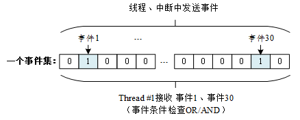
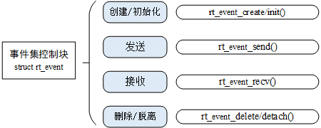

## 事件集

事件集也是线程间同步的机制之一，一个事件集可以包含多个事件，利用事件集可以完成**一对多，多对多**的线程间同步。下面以坐公交为例说明事件，在公交站等公交时可能有以下几种情况：

①P1 坐公交去某地，只有一种公交可以到达目的地，等到此公交即可出发。

②P1 坐公交去某地，有 3 种公交都可以到达目的地，等到其中任意一辆即可出发。

③P1 约另一人 P2 一起去某地，则 P1 必须要等到 “同伴 P2 到达公交站” 与“公交到达公交站”两个条件都满足后，才能出发。

这里，可以将 P1 去某地视为**线程**，将 “公交到达公交站”、“同伴 P2 到达公交站” 视为**事件的发生**，情况①是**特定事件唤醒线程**；情况②是**任意单个事件唤醒线程**；情况③是**多个事件同时发生才唤醒线程**。

事件集针对的三种情况：
- 特定事件唤醒线程
- 任意单个事件唤醒线程（逻辑或）
- 多个事件同时发生唤醒线程（逻辑与）

### 事件集工作机制

事件集主要用于线程间的同步，与信号量不同，它的特点是可以**实现一对多，多对多的同步**。即**一个线程与多个事件**的关系可设置为：其中任意一个事件唤醒线程，或几个事件都到达后才唤醒线程进行后续的处理；同样，事件也可以是**多个线程同步多个事件**。

这种多个事件的集合可以用一个`32位`无符号整型变量来表示，变量的每一位代表一个事件，线程通过 “逻辑与” 或 “逻辑或” 将一个或多个事件关联起来，形成事件组合。事件的 “逻辑或” 也称为是独立型同步，指的是线程与任何事件之一发生同步；事件 “逻辑与” 也称为是关联型同步，指的是线程与若干事件都发生同步。


RT-Thread 定义的事件集有以下特点：

- 事件只与线程相关，事件间相互独立：每个**线程**可拥有 32 个**事件标志**，采用一个 32 bit 无符号整型数 `rt_uint32_t event_set;` 进行记录，每一个 bit 代表一个事件；

- 事件仅用于同步，不提供数据传输功能；

- 事件无排队性，即多次向线程发送同一事件 (如果线程还未来得及读走)，其效果等同于只发送一次。

在 RT-Thread 中，每个线程都拥有一个**事件信息标记** `rt_uint8_t  event_info;` ，它有三个属性，分别是 `RT_EVENT_FLAG_AND` (逻辑与)，`RT_EVENT_FLAG_OR` （逻辑或）以及 `RT_EVENT_FLAG_CLEAR`（清除标记）。当线程等待事件同步时，可以通过 32 个**事件标志**和这个**事件信息标记**来判断当前接收的事件是否满足同步条件。

```C
/**
 * flag defintions in event
 */
#define RT_EVENT_FLAG_AND               0x01            /**< logic and */
#define RT_EVENT_FLAG_OR                0x02            /**< logic or */
#define RT_EVENT_FLAG_CLEAR             0x04            /**< clear flag */
```



如上图所示，线程 \#1 的**事件标志**中第 1 位和第 30 位被置位，如果**事件信息标记位**设为 “逻辑与” ，则表示线程 \#1 只有在事件 1 和事件 30 都发生以后才会被触发唤醒，如果**事件信息标记位**设为 “逻辑或” ，则事件 1 或事件 30 中的任意一个发生都会触发唤醒线程 \#1。如果信息标记**同时设置了清除标记位**，则当线程 \#1 唤醒后将主动把事件 1 和事件 30 清为零，否则事件标志将依然存在（即置 1）。


#### anyway 换句话说明事件集工作机制
我们通过类似操作寄存器的方式来操作**事件标志**`event_set`和**事件信息标记**`event_info`。`event_set`有32位，是线程控制块的参数，我们要将对应事件的位初始“置一”（比如 1 位 和 30 位表示事件 1 和 事件 30，2 位 表示 事件 2 等等），位“置一”表示该事件允许触发（唤醒）线程；`event_info`尽管有8位，但实际控制效果只是后3位，它是用来判断各个触发事件间的 “与或关系” 和 线程允许被触发的次数/情况（可以多次唤醒还是只唤醒一次）。


### 事件集控制块

在 RT-Thread 中，事件集控制块是操作系统用于管理事件的一个数据结构，由结构体 `struct rt_event` 表示。另外一种 C 表达方式 `rt_event_t`，表示的是事件集的句柄，在 C 语言中的实现是事件集控制块的指针。事件集控制块结构的详细定义请见以下代码：

```c
struct rt_event
{
    struct rt_ipc_object parent;    /* 继承自 ipc_object 类 */

    /* 事件集合，每一 bit 表示 1 个事件，bit 位的值可以标记某事件是否发生 */
    rt_uint32_t set;
};
/* rt_event_t 是指向事件结构体的指针类型  */
typedef struct rt_event* rt_event_t;
```

`rt_event` 对象从 `rt_ipc_object` 中派生，由 IPC 容器所管理。

### 事件集的管理方式

事件集控制块中含有与事件集相关的重要参数，在事件集功能的实现中起重要的作用。事件集相关接口如下图所示，对一个事件集的操作包含：创建 / 初始化事件集、发送事件、接收事件、删除 / 脱离事件集。



#### 创建和删除事件集

当创建一个事件集时，内核首先创建一个事件集控制块，然后对该事件集控制块进行基本的初始化，创建事件集使用下面的函数接口：

```c
rt_event_t rt_event_create(const char* name, rt_uint8_t flag);
```

调用该函数接口时，系统会从对象管理器中分配事件集对象，并初始化这个对象，然后初始化父类 IPC 对象。下表描述了该函数的输入参数与返回值：

|**参数**      |**描述**                                                           |
|----------------|---------------------------------------------------------------------|
| name           | 事件集的名称                                                        |
| flag           | 事件集的标志，它可以取如下数值： `RT_IPC_FLAG_FIFO` 或 `RT_IPC_FLAG_PRIO` |
|**返回**      | ——                                                                  |
| RT_NULL        | 创建失败                                                            |
| 事件对象的句柄 | 创建成功                                                            |


> 注：`RT_IPC_FLAG_FIFO` 属于非实时调度方式，除非应用程序非常在意先来后到，并且你清楚地明白所有涉及到该事件集的线程都将会变为非实时线程，方可使用 `RT_IPC_FLAG_FIFO`，否则建议采用 `RT_IPC_FLAG_PRIO`，即确保线程的实时性。

系统不再使用 `rt_event_create()` 创建的事件集对象时，通过删除事件集对象控制块来释放系统资源。删除事件集可以使用下面的函数接口：

```c
rt_err_t rt_event_delete(rt_event_t event);
```

在调用 `rt_event_delete` 函数删除一个事件集对象时，应该确保该事件集不再被使用。在删除前会唤醒所有挂起在该事件集上的线程（线程的返回值是 `-RT_ERROR`），然后释放事件集对象占用的内存块。下表描述了该函数的输入参数与返回值：

|**参数**|**描述**        |
|----------|------------------|
| event    | 事件集对象的句柄 |
|**返回**| ——               |
| RT_EOK   | 成功             |

#### 初始化和脱离事件集

静态事件集对象的内存是在系统编译时由编译器分配的，一般放于读写数据段或未初始化数据段中。在使用静态事件集对象前，需要先行对它进行初始化操作。初始化事件集使用下面的函数接口：

```c
rt_err_t rt_event_init(rt_event_t event, const char* name, rt_uint8_t flag);
```

调用该接口时，需指定静态事件集对象的句柄（即指向事件集控制块的指针），然后系统会初始化事件集对象，并加入到系统对象容器中进行管理。下表描述了该函数的输入参数与返回值：

|**参数**|**描述**                                                           |
|----------|---------------------------------------------------------------------|
| event    | 事件集对象的句柄                                                    |
| name     | 事件集的名称                                                        |
| flag     | 事件集的标志，它可以取如下数值： RT_IPC_FLAG_FIFO 或 RT_IPC_FLAG_PRIO |
|**返回**| ——                                                                  |
| RT_EOK   | 成功                                                                |

系统不再使用 `rt_event_init()` 初始化的事件集对象时，通过脱离事件集对象控制块来释放系统资源。脱离事件集是将事件集对象从内核对象管理器中脱离。脱离事件集使用下面的函数接口：

```c
rt_err_t rt_event_detach(rt_event_t event);
```

用户调用这个函数时，系统首先唤醒所有挂在该事件集等待队列上的线程（线程的返回值是 `-RT_ERROR`），然后将该事件集从内核对象管理器中脱离。下表描述了该函数的输入参数与返回值：

|**参数**|**描述**        |
|----------|------------------|
| event    | 事件集对象的句柄 |
|**返回**| ——               |
| RT_EOK   | 成功             |

#### 发送事件

发送事件函数可以发送事件集中的一个或多个事件，如下：

```c
rt_err_t rt_event_send(rt_event_t event, rt_uint32_t set);
```

使用该函数接口时，通过参数 `set` 指定的事件标志来设定 `event` 事件集对象的事件标志值，然后遍历等待在 `event` 事件集对象上的等待线程链表，判断是否有线程的事件激活要求与当前 `event`


 对象事件标志值匹配，如果有，则唤醒该线程。下表描述了该函数的输入参数与返回值：

|**参数**|**描述**                    |
|----------|------------------------------|
| event    | 事件集对象的句柄             |
| set      | 发送的一个或多个事件的标志值 |
|**返回**| ——                           |
| RT_EOK   | 成功                         |


### 接收事件（重要！！！）

内核使用 32 位的无符号整数来标识事件集，它的每一位代表一个事件，因此一个事件集对象可同时等待接收 32 个事件，内核可以通过指定选择参数 “逻辑与” 或“逻辑或”来选择如何激活线程，使用 “逻辑与” 参数表示只有当所有等待的事件都发生时才激活线程，而使用 “逻辑或” 参数则表示只要有一个等待的事件发生就激活线程。接收事件使用下面的函数接口：

```c
rt_err_t rt_event_recv(rt_event_t event,
                           rt_uint32_t set,
                           rt_uint8_t option,
                           rt_int32_t timeout,
                           rt_uint32_t* recved);
```

当用户调用这个接口时，系统首先根据 `set` 参数和接收选项 `option` 来判断它要接收的事件是否发生，如果已经发生，则根据参数 `option` 上是否设置有 `RT_EVENT_FLAG_CLEAR` 来决定是否重置事件的相应标志位，然后返回（其中 `recved` 参数返回接收到的事件）；如果没有发生，则把等待的 `set` 和 `option` 参数填入线程本身的结构中，然后把线程挂起在此事件上，直到其等待的事件满足条件或等待时间超过指定的超时时间。如果超时时间设置为零，则表示当线程要接受的事件没有满足其要求时就不等待，而直接返回 `-RT_ETIMEOUT`。下表描述了该函数的输入参数与返回值：

|**参数**     |**描述**            |
|---------------|----------------------|
| event         | 事件集对象的句柄     |
| set           | 接收线程感兴趣的事件 |
| option        | 接收选项             |
| timeout       | 指定超时时间         |
| recved        | 指向接收到的事件     |
|**返回**     | ——                   |
| RT_EOK        | 成功                 |
| \-RT_ETIMEOUT | 超时                 |
| \-RT_ERROR    | 错误                 |

option 的值可取：

```c
/* 选择 逻辑与 或 逻辑或 的方式接收事件 */
RT_EVENT_FLAG_OR
RT_EVENT_FLAG_AND

/* 选择清除重置事件标志位 */
RT_EVENT_FLAG_CLEAR
```