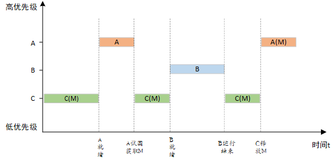

## 为什么使用“互斥量”而不是使用“二值信号量”

为了解决使用二值信号量时，递归调用而造成的线程自锁问题以及优先级反转问题。

### 递归调用造成的线程自锁问题

互斥量允许持有他的线程**递归**持有该互斥量，而二值信号量则不允许（会出现**自锁**）。
代码详见`semaphore_sample.c`文件中。
```C
static void rt_thread3_entry(void *parameter)
{
	static rt_err_t flag;
    while(1)
    {
        /* 信号量test_sem初始为1 */
		/* 永久方式等待信号量，获取到信号量 */
		flag = rt_sem_take(test_sem, RT_WAITING_FOREVER);
		    /* test_sem.value = 0 */
            /* 无法获取到信号量 自动锁死 */ 
            /* 代码循环 */
		if(flag != RT_EOK)
		{	
			rt_kprintf("faild, flag is: %ld\n",flag);
		}
		else
		{
			rt_kprintf("success, flag is: %ld\n",flag);
		}
		
		flag = rt_sem_take(test_sem, RT_WAITING_NO);
				
		if(flag != RT_EOK)
		{	
			rt_kprintf("faild, flag is: %ld\n",flag);
		}
		else
		{
			rt_kprintf("success, flag is: %ld\n",flag);
		}
		
//		flag =  rt_sem_take(test_sem, RT_WAITING_NO);
		
		/* 会等待5个 OS tick */
		flag = rt_sem_take(test_sem, 5);
        /*如果等待设置为永久 则会自动挂起该线程3 反而能执行其他的线程*/
//      flag = rt_sem_take(test_sem, RT_WAITING_FOREVER);
		if(flag != RT_EOK)
		{	
			rt_kprintf("faild, flag is: %ld\n",flag);
		}
		else
		{
			rt_kprintf("success, flag is: %ld\n",flag);
		}

				/* 有释放也不会挂起 */
				/* 可以试试注释下方代码后的效果 */
		        rt_sem_release(test_sem);
				rt_kprintf("4\n");
			
			rt_sem_release(test_sem);
			rt_kprintf("5\n");
		
		rt_sem_release(test_sem);
		rt_kprintf("6\n");
   }
}
```

输出结果为：
```shell

 \ | /
- RT -     Thread Operating System
 / | \     3.1.0 build Apr  9 2025
 2006 - 2018 Copyright by rt-thread team
msh >bo
bool_semaphore_sample
msh >bool_semaphore_sample
create done. test_sem semaphore value = 0.
msh >success, flag is: 0
faild, flag is: -2
faild, flag is: -2
4
5
6
success, flag is: 0
success, flag is: 0
success, flag is: 0
4
5
6
...
```
线程3能够一直循环运行下去。

注释掉所有`rt_sem_release(test_sem)`后的结果为：
```shell

 \ | /
- RT -     Thread Operating System
 / | \     3.1.0 build Apr  9 2025
 2006 - 2018 Copyright by rt-thread team
msh >bo
bool_semaphore_sample
msh >bool_semaphore_sample
create done. test_sem semaphore value = 0.
msh >success, flag is: 0
faild, flag is: -2
faild, flag is: -2
4
5
6
```
线程只能执行一次后挂起，因为循环的第一步就是永久等待信号量。
此时`test_sem`的`value`值为0，无法获取信号量，线程3挂起。
```C
/* 永久方式等待信号量，获取到信号量 */
flag = rt_sem_take(test_sem, RT_WAITING_FOREVER);
```

接着修改`flag = rt_sem_take(test_sem, 5);` 为 `flag = rt_sem_take(test_sem, RT_WAITING_FOREVER);`，线程3将**永远等待**信号量`test_sem`而造成挂起，无法执行线程后续任务。
```shell

 \ | /
- RT -     Thread Operating System
 / | \     3.1.0 build Apr  9 2025
 2006 - 2018 Copyright by rt-thread team
msh >bo
bool_semaphore_sample
msh >bool_semaphore_sample
create done. test_sem semaphore value = 0.
msh >success, flag is: 0
faild, flag is: -2
```

当然，我们可以利用 `Keil` 的 `DeBug` 功能来查看`test_sem`的`value`值来判断线程3的运行过程。


### 优先级翻转问题


所谓优先级翻转，即当一个高优先级线程试图通过信号量机制访问共享资源时，如果该信号量已被一低优先级线程持有，而这个低优先级线程在运行过程中可能又被其它一些中等优先级的线程抢占，因此造成**高优先级线程被许多具有较低优先级的线程阻塞，实时性难以得到保证**。

如下图所示：有优先级为 A、B 和 C 的三个线程，**优先级 A> B > C**。线程 A，B 处于挂起状态，等待某一事件触发，线程 C 正在运行，此时线程 C 开始使用某一共享资源 M。在使用过程中，线程 A 等待的事件到来，线程 A 转为就绪态，因为它比线程 C 优先级高，所以立即执行。但是当线程 A 要使用共享资源 M 时，由于其正在被线程 C 使用，因此线程 A 被挂起切换到线程 C 运行。如果此时线程 B 等待的事件到来，则线程 B 转为就绪态。由于线程 B 的优先级比线程 C 高，且线程B没有用到共享资源 M ，因此线程 B 开始运行，直到其运行完毕，线程 C 才开始运行。只有当线程 C 释放共享资源 M 后，线程 A 才得以执行。在这种情况下，**优先级发生了翻转：线程 B 先于线程 A 运行**。这样便不能保证高优先级线程的响应时间。



在 RT-Thread 操作系统中，互斥量可以解决优先级翻转问题，实现的是**优先级继承协议 (Sha, 1990)**。优先级继承是通过在线程 A 尝试获取共享资源而被挂起的期间内，将线程 C 的优先级提升到线程 A 的优先级别，从而解决优先级翻转引起的问题。这样能够防止 C（间接地防止 A）被 B 抢占，如下图所示。**优先级继承是指，提高某个占有某种资源的低优先级线程的优先级，使之与所有等待该资源的线程中优先级最高的那个线程的优先级相等**，然后执行，而当这个低优先级线程释放该资源时，优先级重新回到初始设定。因此，继承优先级的线程避免了系统资源被任何中间优先级的线程抢占。


> 注：在获得互斥量后，请尽快释放互斥量，并且在持有互斥量的过程中，不得再行更改持有互斥量线程的优先级，否则可能人为引入无界优先级反转的问题。


## 互斥量 mutex

互斥量又叫相互排斥的信号量，是一种特殊的二值信号量。互斥量类似于只有一个车位的停车场：当有一辆车进入的时候，将停车场大门锁住，其他车辆在外面等候。当里面的车出来时，将停车场大门打开，下一辆车才可以进入。

### 互斥量工作机制

互斥量和信号量不同的是：
- **拥有互斥量的线程拥有互斥量的所有权**，互斥量支持递归访问且能防止线程优先级翻转；
- **并且互斥量只能由持有线程释放**，而信号量则可以由任何线程释放。

互斥量的状态只有两种，开锁或闭锁（两种状态值）。当有线程持有它时，互斥量处于**闭锁状态**，由这个**线程获得它的所有权**。相反，当这个线程释放它时，将对互斥量进行开锁，失去它的所有权。当一个线程持有互斥量时，其他线程将不能够对它进行开锁或持有它，持有该互斥量的线程也能够再次获得这个锁而不被挂起，如下图时所示。这个特性与一般的二值信号量有很大的不同：在信号量中，因为已经不存在实例，线程递归持有会发生主动挂起（最终形成死锁）。


### 互斥量控制块
与信号量控制块类似，在 RT-Thread 中，互斥量控制块是操作系统用于管理互斥量的一个数据结构，由结构体 `struct rt_mutex` 表示。另外一种 C 表达方式 `rt_mutex_t`，表示的是互斥量的句柄，在 C 语言中的实现是**指向互斥量控制块的指针**。互斥量控制块结构的详细定义请见以下代码：

```c
struct rt_mutex
    {
        struct rt_ipc_object parent;                /* 继承自 ipc_object 类 */

        rt_uint16_t          value;                   /* 互斥量的值 */
        rt_uint8_t           original_priority;     /* 持有线程的原始优先级 优先级继承 */
        rt_uint8_t           hold;                     /* 持有线程的持有次数 用于递归  */
        struct rt_thread    *owner;                 /* 当前拥有互斥量的线程 */
    };
    /* rt_mutext_t 为指向互斥量结构体的指针类型  */
    typedef struct rt_mutex* rt_mutex_t;
```

`rt_mutex` 对象从 `rt_ipc_object` 中派生，由 `IPC` 容器所管理。

### 互斥量的管理方式

互斥量控制块中含有互斥相关的重要参数，在互斥量功能的实现中起到重要的作用。互斥量相关接口如下图所示，对一个互斥量的操作包含：创建 / 初始化互斥量、获取互斥量、释放互斥量、删除 / 脱离互斥量。


#### 创建和删除互斥量

创建一个互斥量时，内核首先**创建**一个互斥量控制块，然后完成对该控制块的初始化工作。创建互斥量使用下面的函数接口：

```c
rt_mutex_t rt_mutex_create (const char* name, rt_uint8_t flag);
```

可以调用 `rt_mutex_create` 函数创建一个互斥量，它的名字由 `name` 所指定。当调用这个函数时，系统将先从对象管理器中分配一个 `mutex` 对象，并初始化这个对象，然后初始化父类 `IPC` 对象以及与 `mutex` 相关的部分。互斥量的 `flag` 标志已经作废，无论用户选择 `RT_IPC_FLAG_PRIO` 还是 `RT_IPC_FLAG_FIFO`，内核均按照 `RT_IPC_FLAG_PRIO` 处理。下表描述了该函数的输入参数与返回值：

|**参数**  |**描述**                                                         |
|------------|-------------------------------------------------------------------|
| name       | 互斥量的名称                                                      |
| flag       | 该标志已经作废，无论用户选择 RT_IPC_FLAG_PRIO 还是 RT_IPC_FLAG_FIFO，内核均按照 `RT_IPC_FLAG_PRIO` 处理 |
|**返回**  | ——                                                                |
| 互斥量句柄 | 创建成功                                                          |
| RT_NULL    | 创建失败                                                          |

当不再使用互斥量时，通过**删除**互斥量以释放系统资源，适用于动态创建的互斥量。删除互斥量使用下面的函数接口：

```c
rt_err_t rt_mutex_delete (rt_mutex_t mutex);
```

当删除一个互斥量时，所有等待此互斥量的线程都将被唤醒，等待线程获得的返回值是 `-RT_ERROR`。然后系统将该互斥量从内核对象管理器链表中删除并释放互斥量占用的内存空间。下表描述了该函数的输入参数与返回值：

|**参数**|**描述**        |
|----------|------------------|
| mutex    | 互斥量对象的句柄 |
|**返回**| ——               |
| RT_EOK   | 删除成功         |

#### 初始化和脱离互斥量

**静态互斥量对象**的内存是在系统编译时由编译器分配的，一般放于读写数据段或未初始化数据段中。在使用这类静态互斥量对象前，需要先进行初始化。**初始化**互斥量使用下面的函数接口：

```c
rt_err_t rt_mutex_init (rt_mutex_t mutex, const char* name, rt_uint8_t flag);
```

使用该函数接口时，需指定互斥量对象的句柄（即指向互斥量控制块的指针），互斥量名称以及互斥量标志。互斥量标志可用上面创建互斥量函数里提到的标志。下表描述了该函数的输入参数与返回值：

|**参数**|**描述**                                                         |
|----------|-------------------------------------------------------------------|
| mutex    | 互斥量对象的句柄，它由用户提供，并指向互斥量对象的内存块          |
| name     | 互斥量的名称                                                      |
| flag     | 该标志已经作废，无论用户选择 RT_IPC_FLAG_PRIO 还是 RT_IPC_FLAG_FIFO，内核均按照 RT_IPC_FLAG_PRIO 处理 |
|**返回**| ——                                                                |
| RT_EOK   | 初始化成功                                                        |

**脱离**互斥量将把互斥量对象从内核对象管理器中脱离，适用于静态初始化的互斥量。脱离互斥量使用下面的函数接口：

```c
rt_err_t rt_mutex_detach (rt_mutex_t mutex);
```

使用该函数接口后，内核先唤醒所有挂在该互斥量上的线程（线程的返回值是 `-RT_ERROR`），然后系统将该互斥量从内核对象管理器中脱离。下表描述了该函数的输入参数与返回值：

|**参数**|**描述**        |
|----------|------------------|
| mutex    | 互斥量对象的句柄 |
|**返回**| ——               |
| RT_EOK   | 成功             |

#### 获取互斥量（重要！！！）

线程获取了互斥量，那么线程就有了对该互斥量的所有权，**即某一个时刻一个互斥量只能被一个线程持有**。获取互斥量使用下面的函数接口：

```c
rt_err_t rt_mutex_take (rt_mutex_t mutex, rt_int32_t time);
```

如果互斥量没有被其他线程控制，那么申请该互斥量的线程将成功获得该互斥量。**如果互斥量已经被当前线程线程控制，则该互斥量的持有计数加 1，当前线程也不会挂起等待**。如果互斥量已经被其他线程占有，则当前线程在该互斥量上挂起等待，直到其他线程释放它或者等待时间超过指定的超时时间。下表描述了该函数的输入参数与返回值：

|**参数**     |**描述**        |
|---------------|------------------|
| mutex         | 互斥量对象的句柄 |
| time          | 指定等待的时间   |
|**返回**     | ——               |
| RT_EOK        | 成功获得互斥量   |
| \-RT_ETIMEOUT | 超时             |
| \-RT_ERROR    | 获取失败         |

#### 无等待获取互斥量

当用户不想在申请的互斥量上挂起线程进行等待时，可以使用无等待方式获取互斥量，无等待获取互斥量使用下面的函数接口：

```c
rt_err_t rt_mutex_trytake(rt_mutex_t mutex);
```

这个函数与 `rt_mutex_take(mutex, RT_WAITING_NO)` 的作用相同，即当线程申请的互斥量资源实例不可用的时候，它不会等待在该互斥量上，而是直接返回 `-RT_ETIMEOUT`。下表描述了该函数的输入参数与返回值：

| **参数**      | **描述**         |
| ------------- | ---------------- |
| mutex         | 互斥量对象的句柄 |
| **返回**      | ——               |
| RT_EOK        | 成功获得互斥量   |
| \-RT_ETIMEOUT | 获取失败         |

#### 释放互斥量（重要）

当线程完成互斥资源的访问后，应尽快释放它占据的互斥量，使得其他线程能及时获取该互斥量。释放互斥量使用下面的函数接口：

```c
rt_err_t rt_mutex_release(rt_mutex_t mutex);
```

使用该函数接口时，只有已经拥有互斥量控制权的线程才能释放它，每释放一次该互斥量，它的持有计数就减 1。当该互斥量的**持有计数为零**时（即持有线程已经释放所有的持有操作），它变为**可用**，等待在该互斥量上的线程将被唤醒。如果线程的运行优先级被互斥量提升，那么当互斥量被**释放后**，线程**恢复为持有互斥量前的优先级**。下表描述了该函数的输入参数与返回值：

|**参数**|**描述**        |
|----------|------------------|
| mutex    | 互斥量对象的句柄 |
|**返回**| ——               |
| RT_EOK   | 成功             |


## 互斥量的使用场合

互斥量作为一种特殊的二值信号量，它本身就是为了替代二值信号量锁而被提出的。所以互斥量的使用场景比较单一。互斥量就是**锁**，在初始化时，互斥量处于开锁状态，而被线程持有的时候则变为闭锁状态，从而**保护临界资源（共享资源）**、用于**线程间同步**。

针对它解决的问题，我们应用互斥量于：
- 一个线程递归调用（多次持有）互斥量
- 可能会出现多线程同步而造成优先级翻转的情况


> 注意！！！：互斥量**不能**在**中断服务例程**中使用


## 互斥量的例程（翻转信号量测试）

代码例程放置在 `priority_sample.c` 文件中。输入命令`pri_inversion`即可。

这个例子将创建 3 个动态线程以检查持有互斥量时，持有的线程优先级是否被调整到等待线程优先级中的最高优先级。线程 1，2，3 的优先级从高到低 **（priority = 9，10，11）** 分别被创建，线程 3 先持有互斥量，而后线程 2 试图持有互斥量，此时线程 3 的优先级应该被提升为和线程 2 的**优先级相同（priority同为 10 ）**。线程 1 用于检查线程 3 的优先级是否被提升为与线程 2的优先级相同。


输出结果为：
```shell

 \ | /
- RT -     Thread Operating System
 / | \     3.1.0 build Apr  9 2025
 2006 - 2018 Copyright by rt-thread team
msh >pri
pri_inversion
msh >pri_inversion
create dynamic mutex success.
thread2 start!
the priority of thread2 is: 10
thread3 start!
the priority of thread3 is: 11
thread1 test start!
the priority of thread2 is: 10
the priority of thread3 is: 10
test OK.
Before release mutex, the priority of thread3 is: 10
the priority of thread3 is: 11
thread2 end!
the priority of thread2 is: 10
the priority of thread3 is: 11
thread3 end!
the priority of thread3 is: 11
msh >

```

线程 3 先持有互斥量，而后线程 2 试图持有互斥量，此时线程 3 的优先级被提升为和线程 2 的优先级相同。线程 3 的优先级从 11 提高为 10。当 线程 3 **释放**了互斥量后，线程 3 的优先级又降低为原本的优先级 11。


代码例程附下：

```C
/* 
 * Copyright (c) 2006-2018, RT-Thread Development Team 
 * 
 * SPDX-License-Identifier: Apache-2.0 
 * 
 * Change Logs: 
 * Date           Author       Notes 
 * 2018-08-24     yangjie      the first version
 * 2025-04-10     RINZERON     the second version 
 */ 

/*
 * 程序清单：互斥量使用例程
 *
 * 这个例子将创建 3 个动态线程以检查持有互斥量时，持有的线程优先级是否
 * 被调整到等待线程优先级中的最高优先级。
 *
 * 线程 1，2，3 的优先级从高到低分别被创建，
 * 线程 3 先持有互斥量，而后线程 2 试图持有互斥量，此时线程 3 的优先级应该
 * 被提升为和线程 2 的优先级相同。线程 1 用于检查线程 3 的优先级是否被提升
 * 为与线程 2的优先级相同。
 */
#include <rtthread.h>

/* 指向线程控制块的指针 */
static rt_thread_t tid1 = RT_NULL;
static rt_thread_t tid2 = RT_NULL;
static rt_thread_t tid3 = RT_NULL;
static rt_mutex_t mutex = RT_NULL;


#define THREAD_PRIORITY       10
#define THREAD_STACK_SIZE     512
#define THREAD_TIMESLICE      5

/* 线程 1 入口 */
static void thread1_entry(void *parameter)
{
    /* 先让低优先级线程运行 */
    rt_thread_mdelay(100);

    /* 此时 thread3 持有 mutex，并且 thread2 等待持有 mutex */

    /* 检查 rt_kprintf("the producer generates a number: %d\n", array[set%MAXSEM]); 与 thread3 的优先级情况 */
	rt_kprintf("thread1 test start!\n");
	
    if (tid2->current_priority != tid3->current_priority)
    {
        /* 优先级不相同，测试失败 */
        rt_kprintf("the priority of thread2 is: %d\n", tid2->current_priority);
        rt_kprintf("the priority of thread3 is: %d\n", tid3->current_priority);
        rt_kprintf("test failed.\n");
        return;
    }
    else
    {
        rt_kprintf("the priority of thread2 is: %d\n", tid2->current_priority);
        rt_kprintf("the priority of thread3 is: %d\n", tid3->current_priority);
        rt_kprintf("test OK.\n");
    }
}

/* 线程 2 入口 */
static void thread2_entry(void *parameter)
{
    rt_err_t result;
	
	rt_kprintf("thread2 start!\n");
    rt_kprintf("the priority of thread2 is: %d\n", tid2->current_priority);

    /* 先让低优先级线程运行 */
    rt_thread_mdelay(50);


    /*
     * 试图持有互斥锁，此时 thread3 持有，应把 thread3 的优先级提升
     * 到 thread2 相同的优先级
     */
    result = rt_mutex_take(mutex, RT_WAITING_FOREVER);

    if (result == RT_EOK)
    {
        /* 释放互斥锁 */
        rt_mutex_release(mutex);
		rt_kprintf("the priority of thread3 is: %d\n", tid3->current_priority);

    }
	
	
	rt_kprintf("thread2 end!\n");
	rt_kprintf("the priority of thread2 is: %d\n", tid2->current_priority);
	rt_kprintf("the priority of thread3 is: %d\n", tid3->current_priority);

}

/* 线程 3 入口 */
static void thread3_entry(void *parameter)
{
    rt_tick_t tick;
    rt_err_t result;
	rt_kprintf("thread3 start!\n");
    rt_kprintf("the priority of thread3 is: %d\n", tid3->current_priority);

    result = rt_mutex_take(mutex, RT_WAITING_FOREVER);
    if (result != RT_EOK)
    {
        rt_kprintf("thread3 take a mutex, failed.\n");
    }

    /* 做一个长时间的循环，500ms */
    tick = rt_tick_get();
    while (rt_tick_get() - tick < (RT_TICK_PER_SECOND / 2)) ;

	rt_kprintf("Before release mutex, the priority of thread3 is: %d\n", tid3->current_priority);
    rt_mutex_release(mutex);
	
	rt_kprintf("thread3 end!\n");
	rt_kprintf("the priority of thread3 is: %d\n", tid3->current_priority);
}

int pri_inversion(void)
{
    /* 创建互斥锁 */
    mutex = rt_mutex_create("mutex", RT_IPC_FLAG_FIFO);
    if (mutex == RT_NULL)
    {
        rt_kprintf("create dynamic mutex failed.\n");
        return -1;
    }
	else
	{
		rt_kprintf("create dynamic mutex success.\n");
	}

    /* 创建线程 1 */
    tid1 = rt_thread_create("thread1",
                            thread1_entry, 
                            RT_NULL,
                            THREAD_STACK_SIZE, 
                            THREAD_PRIORITY - 1, THREAD_TIMESLICE);
    if (tid1 != RT_NULL)
         rt_thread_startup(tid1);
 
    /* 创建线程 2 */
    tid2 = rt_thread_create("thread2",
                            thread2_entry, 
                            RT_NULL, 
                            THREAD_STACK_SIZE, 
                            THREAD_PRIORITY, THREAD_TIMESLICE);
    if (tid2 != RT_NULL)
        rt_thread_startup(tid2);

    /* 创建线程 3 */
    tid3 = rt_thread_create("thread3",
                            thread3_entry, 
                            RT_NULL, 
                            THREAD_STACK_SIZE, 
                            THREAD_PRIORITY + 1, THREAD_TIMESLICE);
    if (tid3 != RT_NULL)
        rt_thread_startup(tid3);

    return 0;
}

/* 导出到 msh 命令列表中 */
MSH_CMD_EXPORT(pri_inversion, pri_inversion sample);

```

