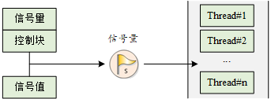
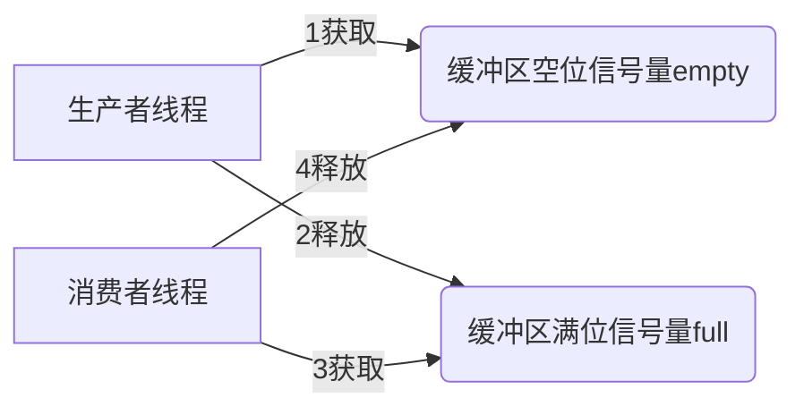
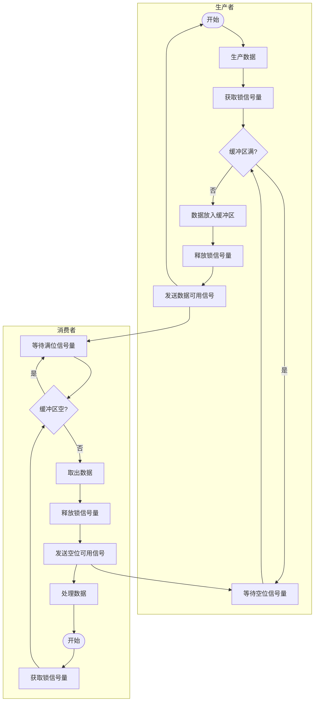
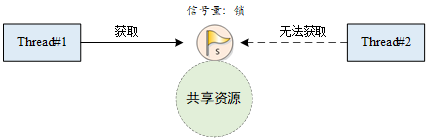
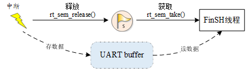

## 线程同步的概念

同步 ≠ 同时，“同步”是指多个线程按预定的**先后次序**进行运行，“同时”是指同一个时间多个线程一起运行。

假定某个共享内存块A，如果它的访问不具备排他性，则它会同时被`线程1`和`线程2`访问，那么就有可能导致数据一致性的问题。比如`线程1`按位写入数据0xff，而`线程2`读取数据。如果线程1才写入了部分数据（0xf0），`线程2`就读走了，那么读取的数据就是错的。这样会造成系统后续的一系列问题。所以线程对共享内存的访问必须是具有排他性的。`线程1`和`线程2`互斥访问共享内存A。显然，这又会涉及到一个访问次序问题。

那系统如何确定`线程1`和`线程2`的**访问次序**呢？即如何实现这个**同步**呢？RT-Thread 提供了多种方法：**信号量（samaphore）、互斥量（mutex）和事件集（event）**。


使用信号量和互斥量的注意事项：
- 信号量可以在中断中释放，但不能在中断服务程序中获取
- 在获得互斥量后，应该尽快释放互斥量，并且在持有互斥量的过程中，不得更改持有互斥量线程的优先级
- 互斥量不能再中断服务例程中使用

> 注：线程同步就是确定各个线程运行的先后次序。保护临界资源的线程互斥可看作一种特殊的线程同步。

## 信号量 semaphore

简单的例子：停车！

停车场管理员就相当于信号量，管理员手中空车位的个数就是信号量的值（非负数，动态变化）；停车位相当于公共资源（临界区），车辆相当于线程。车辆通过获得管理员的允许取得停车位，就类似于线程通过获得信号量访问公共资源。

### 信号量的工作机制

信号量是一种轻型的用于解决线程间同步问题的内核对象，线程可以获取或释放它，从而达到同步或者互斥的目的。


### 信号量控制块
在 RT-Thread 中，信号量控制块是操作系统用于管理信号量的一个数据结构，由结构体 `struct rt_semaphore` 表示。另外一种 C 表达方式 `rt_sem_t`，表示的是信号量的句柄，在 C 语言中的实现是**指向信号量控制块的指针**。信号量控制块结构的详细定义如下：
```C
struct rt_semaphore
{
   struct rt_ipc_object parent;  /* 继承自 ipc_object 类 */
   rt_uint16_t value;            /* 信号量的值 最大65535*/
};
/* rt_sem_t 是指向 semaphore 结构体的指针类型 */
typedef struct rt_semaphore* rt_sem_t;
```

### 信号量的管理方式

信号量控制块中含有信号量相关的重要参数，在信号量各种状态间起到纽带的作用。信号量相关接口如下图所示，对一个信号量的操作包含：创建 / 初始化信号量、获取信号量、释放信号量、删除 / 脱离信号量。


#### 创建和删除信号量

当创建一个信号量时，内核首先创建一个信号量控制块，然后对该控制块进行基本的初始化工作，创建**动态信号量对象**使用下面的函数接口：

```c
/* 创建信号量 */
 rt_sem_t rt_sem_create(const char *name,
                        rt_uint32_t value,
                        rt_uint8_t flag);
```

当调用这个函数时，系统将先从对象管理器中分配一个 `semaphore` 对象，并初始化这个对象，然后初始化父类 `IPC` 对象以及与 `semaphore` 相关的部分。在创建信号量指定的参数中，**信号量标志参数**`flag`决定了当信号量不可用时，多个线程等待的排队方式。当选择 `RT_IPC_FLAG_FIFO`（先进先出）方式时，那么等待线程队列将按照先进先出的方式排队，先进入的线程将先获得等待的信号量；当选择 `RT_IPC_FLAG_PRIO`（优先级等待）方式时，等待线程队列将按照优先级进行排队，优先级高的等待线程将先获得等待的信号量。


> 注：`RT_IPC_FLAG_FIFO` 属于**非实时调度方式**，除非应用程序非常在意先来后到，并且你清楚地明白所有涉及到该信号量的线程都将会变为非实时线程，方可使用 `RT_IPC_FLAG_FIFO`，否则建议采用 `RT_IPC_FLAG_PRIO`，即确保线程的实时性。

下表描述了该函数的输入参数与返回值：

|**参数**          |**描述**                                                         |
|--------------------|-------------------------------------------------------------------|
| name               | 信号量名称                                                        |
| value              | 信号量初始值                                                      |
| flag               | 信号量标志参数，它可以取如下数值： RT_IPC_FLAG_FIFO （先进先出）或 RT_IPC_FLAG_PRIO （优先级等待）|
|**返回**          | ——                                                                |
| RT_NULL            | 创建失败                                                          |
| 信号量的控制块指针 | 创建成功                                                          |

系统不再使用信号量时，可通过删除信号量以释放系统资源，适用于**动态创建的信号量**。删除信号量使用下面的函数接口：

```c
rt_err_t rt_sem_delete(rt_sem_t sem);   //删除信号量
```

调用这个函数时，系统将删除这个信号量。如果删除该信号量时，有线程正在等待该信号量，那么删除操作会先**唤醒等待在该信号量上的线程**（等待线程的返回值是 `-RT_ERROR`），然后再释放信号量的内存资源。下表描述了该函数的输入参数与返回值：

|**参数**|**描述**                        |
|----------|----------------------------------|
| sem      | `rt_sem_create()` 创建的信号量对象 |
|**返回**| ——                               |
| RT_EOK   | 删除成功                         |

#### 初始化和脱离信号量

对于**静态信号量对象**，它的内存空间在编译时期就被编译器分配出来，放在读写数据段或未初始化数据段上，此时使用信号量就不再需要使用 `rt_sem_create` 接口来创建它，而只需在使用前对它进行初始化即可。初始化信号量对象可使用下面的函数接口：

```c
/* 初始化信号量 */
rt_err_t rt_sem_init(rt_sem_t       sem,
                    const char     *name,
                    rt_uint32_t    value,
                    rt_uint8_t     flag)
```

当调用这个函数时，系统将对这个 `semaphore` 对象进行初始化，然后初始化 IPC 对象以及与
`semaphore` 相关的部分。信号量标志可用上面创建信号量函数里提到的标志。下表描述了该函数的输入参数与返回值：

|**参数**|**描述**                                                         |
|----------|-------------------------------------------------------------------|
| sem      | 信号量对象的句柄                                                  |
| name     | 信号量名称                                                        |
| value    | 信号量初始值                                                      |
| flag     | 信号量标志，它可以取如下数值： RT_IPC_FLAG_FIFO 或 RT_IPC_FLAG_PRIO |
|**返回**| ——                                                                |
| RT_EOK   | 初始化成功                                                        |

脱离信号量就是让信号量对象从内核对象管理器中脱离，适用于**静态初始化的信号量**。脱离信号量使用下面的函数接口：

```c
rt_err_t rt_sem_detach(rt_sem_t sem);   //脱离信号量
```

使用该函数后，内核先唤醒所有挂在该信号量等待队列上的线程，然后将该信号量从内核对象管理器中脱离。原来挂起在信号量上的等待线程将获得 `- RT_ERROR` 的返回值。下表描述了该函数的输入参数与返回值：

|**参数**|**描述**        |
|----------|------------------|
| sem      | 信号量对象的句柄 |
|**返回**| ——               |
| RT_EOK   | 脱离成功         |

#### 获取信号量（重要！！！）

线程通过**获取**信号量来获得信号量资源实例，当信号量值大于零时，线程将获得信号量，并且相应的信号量值会减 1，获取信号量使用下面的函数接口：

```c
rt_err_t rt_sem_take (rt_sem_t sem, rt_int32_t time);
```

在调用这个函数时，如果**信号量的值等于零**，那么说明当前信号量**资源实例不可用**，申请该信号量的线程将根据 `time` 参数的情况选择直接返回、或挂起等待一段时间、或永久等待，直到其他线程或中断释放该信号量。如果在参数 `time` 指定的时间内依然得不到信号量，线程将超时返回，返回值是 `- RT_ETIMEOUT`。下表描述了该函数的输入参数与返回值：

|**参数**     |**描述**                                         |
|---------------|---------------------------------------------------|
| sem           | 信号量对象的句柄                                  |
| time          | 指定的**等待**时间，单位是操作系统时钟节拍（OS Tick），其中`RT_WAITING_FOREVER = -1` 表示永远等待，`RT_WAITING_NO = 0`则直接返回|
|**返回**     | ——                                                |
| RT_EOK        | 成功获得信号量                                    |
| \-RT_ETIMEOUT | **超时**依然未获得信号量                              |
| \-RT_ERROR    | 其他错误                                          |

#### 无等待获取信号量

当用户**不想**在申请的信号量上**挂起线程**进行**等待**时，可以使用无等待方式获取信号量，无等待获取信号量使用下面的函数接口：

```c
rt_err_t rt_sem_trytake(rt_sem_t sem)
{
   return rt_sem_take(sem, 0);
}
```

这个函数与 `rt_sem_take(sem, RT_WAITING_NO)` 的作用相同，即当线程申请的信号量资源实例不可用的时候，它不会等待在该信号量上，而是直接返回 `- RT_ETIMEOUT`。下表描述了该函数的输入参数与返回值：

|**参数**     |**描述**        |
|---------------|------------------|
| sem           | 信号量对象的句柄 |
|**返回**     | ——               |
| RT_EOK        | 成功获得信号量   |
| \-RT_ETIMEOUT | 获取失败         |


#### 释放信号量（重要！！！）

释放信号量可以唤醒挂起在该信号量上的线程。释放信号量使用下面的函数接口：

```c
rt_err_t rt_sem_release(rt_sem_t sem);
```

例如当信号量的值等于零时，并且有线程等待这个信号量时，释放信号量将唤醒等待在该信号量线程队列中的第一个线程，由它获取信号量；否则将把信号量的值加 1。下表描述了该函数的输入参数与返回值：

|**参数**|**描述**        |
|----------|------------------|
| sem      | 信号量对象的句柄 |
|**返回**| ——               |
| RT_EOK   | 成功释放信号量   |


### 信号量例程
这里有一个简单的信号量使用例程创建了一个动态信号量，初始化两个线程，一个线程发送信号量，一个线程接收到信号量后，执行相应的操作。代码放置在`semaphore_sample.c`文件中

该例程的仿真结果如下：
```shell

 \ | /
- RT -     Thread Operating System
 / | \     3.1.0 build Mar 31 2025
 2006 - 2018 Copyright by rt-thread team
msh >se
semaphore_sample
msh >semaphore_sample
create done. dynamic semaphore value = 0.
msh >t1 release a dynamic semaphore.
t2 take a dynamic semaphore. number = 1
t1 release a dynamic semaphore.
t2 take a dynamic semaphore. number = 2
t1 release a dynamic semaphore.
t2 take a dynamic semaphore. number = 3
t1 release a dynamic semaphore.
t2 take a dynamic semaphore. number = 4
t1 release a dynamic semaphore.
...
```


## 信号量应用示例-生产者和消费者


**生产者和消费者**例程在`producer_sample.c`文件中。本例程将使用 2 个线程、3 个信号量实现。其中：

3 个信号量分别为：①lock：信号量锁的作用，因为 2 个线程都会对同一个数组 array 进行操作，所以该数组是一个共享资源，锁用来保护这个共享资源。②empty：空位个数，初始化为 5 个空位。③full：满位个数，初始化为 0 个满位。

2 个线程分别为：①生产者线程：获取到空位后，产生一个数字，循环放入数组中，然后释放一个满位。②消费者线程：获取到满位后，读取数组内容并相加，然后释放一个空位。

### 问题解析

两个线程：**生产者**和**消费者**共享一个初始为空、固定大小为 n 的缓冲区，即数组 array。

生产者的工作是“生产”一段数据，只有缓冲区**没满**时，生产者才能把消息放入到缓冲区，否则必须等待，如此反复；

同时，只有缓冲区**非空**时，消费者才能从中取出数据，一次消费一段数据，否则必须等待，如此反复。

问题的核心在于：
- 保证不让生产者在缓冲区还是满的时候向内写数据
- 保证不让消费者从空的缓冲区中取数据

这里涉及到线程间**互斥**和**同步**的关系问题
- 生产者和消费者必须互斥地访问临界资源——缓冲区数组array


- 两个线程相互协作，生产者生产后，消费者才能消费




总的流程图如下：




> 注意：RT-Thread 5.0 及更高的版本将 `ALIGN` 关键字改成了 `rt_align`，使用时注意修改。


代码详情如下
```C
/* 
 * Copyright (c) 2006-2018, RT-Thread Development Team 
 * 
 * SPDX-License-Identifier: Apache-2.0 
 * 
 * Change Logs: 
 * Date           Author       Notes 
 * 2018-08-24     yangjie      the first version 
 */  

/*
 * 程序清单：生产者消费者例子
 *
 * 这个例子中将创建两个线程用于实现生产者消费者问题
 *（1）生产者线程将cnt值每次加1并循环存入array数组的5个成员内；
 *（2）消费者线程将生产者中生产的数值打印出来，并累加求和
 */
#include <rtthread.h>

#define THREAD_PRIORITY       6
#define THREAD_STACK_SIZE     512
#define THREAD_TIMESLICE      5

/* 定义最大5个元素能够被产生 */
#define MAXSEM 5

/* 用于放置生产的整数数组 */
rt_uint32_t array[MAXSEM];

/* 指向生产者、消费者在array数组中的读写位置 */
static rt_uint32_t set, get;

/* 指向线程控制块的指针 */
static rt_thread_t producer_tid = RT_NULL;
static rt_thread_t consumer_tid = RT_NULL;

struct rt_semaphore sem_lock;	//lock 信号量 锁
struct rt_semaphore sem_empty, sem_full;	//空位信号量 满位信号量

/* 生产者线程入口 */
void producer_thread_entry(void *parameter)
{
    int cnt = 0;

    /* 运行10次 */
    while (cnt < 10)
    {
        /* 获取一个空位 */
        rt_sem_take(&sem_empty, RT_WAITING_FOREVER);

        /* 修改array内容，上锁 */
        rt_sem_take(&sem_lock, RT_WAITING_FOREVER);
        array[set % MAXSEM] = cnt + 1;
        rt_kprintf("the producer generates a number: %d\n", array[set % MAXSEM]);
        set++;
        rt_sem_release(&sem_lock);

        /* 发布一个满位 */
        rt_sem_release(&sem_full);
        cnt++;

        /* 暂停一段时间 */
        rt_thread_mdelay(20);
    }

    rt_kprintf("the producer exit!\n");
}

/* 消费者线程入口 */
void consumer_thread_entry(void *parameter)
{
    rt_uint32_t sum = 0;

    while (1)
    {
        /* 获取一个满位 */
        rt_sem_take(&sem_full, RT_WAITING_FOREVER);

        /* 临界区，上锁进行操作 */
        rt_sem_take(&sem_lock, RT_WAITING_FOREVER);
        sum += array[get % MAXSEM];
        rt_kprintf("the consumer[%d] get a number: %d\n", (get % MAXSEM), array[get % MAXSEM]);
        get++;
        rt_sem_release(&sem_lock);

        /* 释放一个空位 */
        rt_sem_release(&sem_empty);

        /* 生产者生产到10个数目，停止，消费者线程相应停止 */
        if (get == 10) break;

        /* 暂停一小会时间 */
        rt_thread_mdelay(50);
    }

    rt_kprintf("the consumer sum is: %d\n", sum);
    rt_kprintf("the consumer exit!\n");
}

int producer_consumer(void)
{
    set = 0;
    get = 0;

    /* 初始化3个信号量 */
    rt_sem_init(&sem_lock, "lock",     1,      RT_IPC_FLAG_FIFO);	//lock锁
    rt_sem_init(&sem_empty, "empty",   MAXSEM, RT_IPC_FLAG_FIFO);	//空位
    rt_sem_init(&sem_full, "full",     0,      RT_IPC_FLAG_FIFO);	//满位

    /* 创建生产者线程 */
    producer_tid = rt_thread_create("producer",
                                    producer_thread_entry, RT_NULL,
                                    THREAD_STACK_SIZE,
                                    THREAD_PRIORITY - 1, THREAD_TIMESLICE);
    if (producer_tid != RT_NULL)
    {
        rt_thread_startup(producer_tid);
    }
    else
    {
        rt_kprintf("create thread producer failed");
        return -1;
    }

    /* 创建消费者线程 */
    consumer_tid = rt_thread_create("consumer",
                                    consumer_thread_entry, RT_NULL,
                                    THREAD_STACK_SIZE,
                                    THREAD_PRIORITY + 1, THREAD_TIMESLICE);
    if (consumer_tid != RT_NULL)
    {
        rt_thread_startup(consumer_tid);
    }
    else
    {
        rt_kprintf("create thread consumer failed");
        return -1;
    }

    return 0;
}

/* 导出到 msh 命令列表中 */
MSH_CMD_EXPORT(producer_consumer, producer_consumer sample);

```

该例程的仿真结果如下：

```shell

 \ | /
- RT -     Thread Operating System
 / | \     3.1.0 build Mar 31 2025
 2006 - 2018 Copyright by rt-thread team
msh >pro
producer_consumer
msh >producer_consumer
the producer generates a number: 1
the consumer[0] get a number: 1
msh >the producer generates a number: 2
the producer generates a number: 3
the consumer[1] get a number: 2
the producer generates a number: 4
the producer generates a number: 5
the producer generates a number: 6
the consumer[2] get a number: 3
the producer generates a number: 7
the producer generates a number: 8
the consumer[3] get a number: 4
the producer generates a number: 9
the consumer[4] get a number: 5
the producer generates a number: 10
the producer exit!
the consumer[0] get a number: 6
the consumer[1] get a number: 7
the consumer[2] get a number: 8
the consumer[3] get a number: 9
the consumer[4] get a number: 10
the consumer sum is: 55
the consumer exit!
```


本例程可以理解为生产者生产产品放入仓库，消费者从仓库中取走产品。

（1）生产者线程：

1）获取 1 个空位（放产品 number），此时空位减 1；

2）上锁保护；本次的产生的 number 值为 cnt+1，把值循环存入数组 array 中；再开锁；

3）释放 1 个满位（给仓库中放置一个产品，仓库就多一个满位），满位加 1；

（2）消费者线程：

1）获取 1 个满位（取产品 number），此时满位减 1；

2）上锁保护；将本次生产者生产的 number 值从 array 中读出来，并与上次的 number 值相加；再开锁；

3）释放 1 个空位（从仓库上取走一个产品，仓库就多一个空位），空位加 1。

生产者依次产生 10 个 number，消费者依次取走，并将 10 个 number 的值求和。信号量锁 lock 保护 array 临界区资源：保证了消费者每次取 number 值的排他性，实现了线程间同步。


共享资源 array 各个信号量值的情况是：
```rust
初始                          最后
array[5] = {0, 0, 0, 0, 0}    array[5] = {6, 7, 8, 9, 10}
lock     = 1                  lock     = 1
full     = 0        ---->     full     = 0
emtpty   = 5                  empty    = 5
``` 


## 信号量的使用场合

信号量是一种非常灵活的同步方式，可以运用在多种场合中。形成锁、同步、资源计数等关系，也能方便的用于线程与线程、中断与线程间的同步中。

### 线程同步

线程同步是信号量最简单的一类应用。例如，使用信号量进行两个线程之间的同步，信号量的值初始化成 0，表示具备 0 个信号量资源实例；而尝试获得该信号量的线程，将直接在这个信号量上进行等待。

当持有信号量的线程完成它处理的工作时，释放这个信号量，可以把等待在这个信号量上的线程唤醒，让它执行下一部分工作。这类场合也可以看成把信号量用于工作完成标志：持有信号量的线程完成它自己的工作，然后通知等待该信号量的线程继续下一部分工作。

### ~~锁~~（该功能仅做了解 已被互斥量取代）

锁，单一的锁常应用于多个线程间对同一共享资源（即临界区）的访问。信号量在作为锁来使用时，通常应将信号量资源实例初始化成 1，代表系统默认有一个资源可用，因为信号量的值始终在 1 和 0 之间变动，所以这类锁也叫做**二值信号量**。如下图所示，当线程需要访问共享资源时，它需要先获得这个资源锁。当这个线程成功获得资源锁时，其他打算访问共享资源的线程会由于获取不到资源而挂起，这是因为其他线程在试图获取这个锁时，这个锁已经被锁上（信号量值是 0）。当获得信号量的线程处理完毕，退出临界区时，它将会释放信号量并把锁解开，而挂起在锁上的第一个等待线程将被唤醒从而获得临界区的访问权。




> 注：在计算机操作系统发展历史上，人们早期使用二值信号量来保护临界区，但是在1990年，研究人员发现了使用信号量保护临界区会导致**无界优先级反转**的问题，因此提出了互斥量的概念。如今，我们已经不使用二值信号量来保护临界区，**互斥量**取而代之。

### 中断与线程的同步

信号量也能够方便地应用于中断与线程间的同步，例如一个中断触发，中断服务例程需要通知线程进行相应的数据处理。这个时候可以设置信号量的初始值是 0，线程在试图持有这个信号量时，由于信号量的初始值是 0，线程直接在这个信号量上挂起直到信号量被释放。当中断触发时，先进行与硬件相关的动作，例如从硬件的 I/O 口中读取相应的数据，并确认中断以清除中断源，而后释放一个信号量来唤醒相应的线程以做后续的数据处理。例如 FinSH 线程的处理方式，如下图所示。



信号量的值初始为 0，当 FinSH 线程试图取得信号量时，因为信号量值是 0，所以它会被挂起。当 console 设备有数据输入时，产生中断，从而进入中断服务例程。在中断服务例程中，它会读取 console 设备的数据，并把读得的数据放入 UART buffer 中进行缓冲，而后释放信号量，释放信号量的操作将唤醒 shell 线程。在中断服务例程运行完毕后，如果系统中没有比 shell 线程优先级更高的就绪线程存在时，shell 线程将持有信号量并运行，从 UART buffer 缓冲区中获取输入的数据。


> 注：中断与线程间的互斥不能采用信号量（锁）的方式，而应采用**开关中断**的方式。

### 资源计数

信号量也可以认为是一个递增或递减的计数器，需要注意的是信号量的值非负。例如：初始化一个信号量的值为 5，则这个信号量可最大连续减少 5 次，直到计数器减为 0。资源计数适合于**线程间工作处理速度不匹配**的场合，这个时候信号量可以做为前一线程工作完成个数的计数，而当调度到后一线程时，它也可以以一种连续的方式一次处理多个事件。例如，生产者与消费者问题中，生产者可以对信号量进行多次释放，而后消费者被调度到时能够一次处理多个信号量资源。


> 注：一般资源计数类型多是混合方式的线程间同步，因为对于单个的资源处理依然存在线程的多重访问，这就需要对一个单独的资源进行访问、处理，并进行锁方式的互斥操作。


