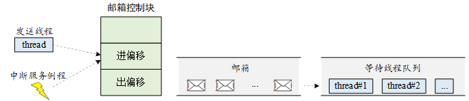

## 什么是线程间通信？

> 顾名思义，线程间通信就是在线程间传递信息。

在裸机编程中，经常会使用**全局变量**进行功能间的通信，如某些功能可能由于一些操作而改变全局变量的值，另一个功能对此全局变量进行读取，根据读取到的全局变量值执行相应的动作，达到通信协作的目的。

RT-Thread 中则提供了更多的工具帮助在不同的线程中间传递信息，本章会详细介绍**邮箱、消息队列、信号**，这些用于线程间的通信的工具。


## 邮箱

邮箱服务是实时操作系统中一种典型的线程间通信方法。


举一个简单的例子，有两个线程，线程 1 检测按键状态并发送，线程 2 读取按键状态并根据按键的状态相应地改变 LED 的亮灭。这里就可以使用邮箱的方式进行通信，线程 1 将按键的状态作为邮件发送到邮箱，线程 2 在邮箱中读取邮件获得按键状态并对 LED 执行亮灭操作。

这里的线程 1 也可以扩展为多个线程。例如，共有三个线程，线程 1 检测并发送按键状态，线程 2 检测并发送 ADC 采样信息，线程 3 则根据接收的信息类型不同，执行不同的操作。


### 邮箱的工作机制

RT-Thread 操作系统的邮箱用于线程间通信，特点是**开销比较低，效率较高**。邮箱中的每一封邮件只能容纳固定的 **4 字节**内容（针对 **32 位**处理系统，指针的大小即为 4 个字节，所以一封邮件恰好能够容纳一个指针）。典型的邮箱也称作交换消息，如下图所示，**线程**或**中断服务例**程把一封 4 字节长度的邮件发送到邮箱中，而一个或多个线程可以从邮箱中接收这些邮件并进行处理。



非阻塞方式的邮件发送过程能够安全的应用于中断服务中，是线程、中断服务、定时器向线程发送消息的有效手段。通常来说，邮件收取过程可能是阻塞的，这取决于邮箱中是否有邮件，以及收取邮件时设置的超时时间。当邮箱中不存在邮件且超时时间不为 0 时，邮件收取过程将变成阻塞方式。在这类情况下，只能由线程进行邮件的收取。

当一个线程向邮箱发送邮件时，如果邮箱**没满**，将把邮件复制到邮箱中。如果邮箱已经满了，发送线程可以设置超时时间，选择等待挂起或直接返回 `-RT_EFULL`。如果发送线程选择挂起等待，那么当邮箱中的**邮件被收取而空出空间**来时，等待挂起的发送线程将被唤醒继续发送。

当一个线程从邮箱中接收邮件时，如果邮箱是空的，接收线程可以选择是否等待挂起直到收到新的邮件而唤醒，或可以设置超时时间。当达到设置的超时时间，邮箱依然未收到邮件时，这个选择超时等待的线程将被唤醒并返回 `-RT_ETIMEOUT`。如果邮箱中存在邮件，那么接收线程将复制邮箱中的 4 个字节邮件到接收缓存中。

### 邮箱控制块

在 RT-Thread 中，邮箱控制块是操作系统用于管理邮箱的一个数据结构，由结构体 `struct rt_mailbox` 表示。另外一种 C 表达方式 `rt_mailbox_t`，表示的是邮箱的句柄，在 C 语言中的实现是邮箱控制块的指针。邮箱控制块结构的详细定义请见以下代码：

```c
struct rt_mailbox
{
    struct rt_ipc_object parent;          /* 继承自IPC容器 */
    rt_uint32_t* msg_pool;                /* 邮箱缓冲区的开始地址 */
    rt_uint16_t size;                     /* 邮箱缓冲区的大小 能够存储的邮件个数    */

    rt_uint16_t entry;                    /* 邮箱中邮件的数目     */
    rt_uint16_t in_offset, out_offset;    /* 邮箱缓冲的进出指针   */
    rt_list_t suspend_sender_thread;      /* 发送线程的挂起等待队列 */
};
typedef struct rt_mailbox* rt_mailbox_t;
```

rt_mailbox 对象从 `rt_ipc_object` 中派生，由 IPC 容器所管理。

- 定义静态邮箱：`struct rt_mailbox static_mb`
- 定义动态邮箱：`rt_mailbox_t dynamic_mb`


### 邮箱的管理方式

邮箱控制块是一个结构体，其中含有事件相关的重要参数，在邮箱的功能实现中起重要的作用。邮箱的相关接口如下图所示，对一个邮箱的操作包含：创建 / 初始化邮箱、发送邮件、接收邮件、删除 / 脱离邮箱。


#### 创建和删除邮箱

动态创建一个邮箱对象可以调用如下的函数接口：

```c
rt_mailbox_t rt_mb_create (const char* name, rt_size_t size, rt_uint8_t flag);
```

创建邮箱对象时会先从对象管理器中分配一个邮箱对象，然后给邮箱**动态分配**一块内存空间用来存放邮件，这块**内存的大小等于邮件大小（4 字节）与邮箱容量的乘积**，接着初始化接收邮件数目和发送邮件在邮箱中的偏移量。下表描述了该函数的输入参数与返回值：

|**参数**      |**描述**  |
|----------------|---------------------|
| name           | 邮箱名称      |
| size           | 邮箱容量 （能够存储的邮件数/最多邮件个数）   |
| flag           | 邮箱标志，它可以取如下数值： `RT_IPC_FLAG_FIFO` 或 `RT_IPC_FLAG_PRIO` |
|**返回**      | ——            |
| RT_NULL        | 创建失败         |
| 邮箱对象的句柄 | 创建成功           |


> [!NOTE]
> 注：`RT_IPC_FLAG_FIFO` 属于非实时调度方式（**先进先出模式**），除非应用程序非常在意先来后到，并且你清楚地明白所有涉及到该邮箱的线程都将会变为非实时线程，方可使用 `RT_IPC_FLAG_FIFO`，否则建议采用 `RT_IPC_FLAG_PRIO`（**优先级模式**），即确保线程的实时性。

当用 `rt_mb_create()` 创建的邮箱不再被使用时，应该删除它来释放相应的系统资源，一旦操作完成，邮箱将被永久性的删除。删除邮箱的函数接口如下：

```c
rt_err_t rt_mb_delete (rt_mailbox_t mb);
```

删除邮箱时，如果有线程被挂起在该邮箱对象上，内核先唤醒挂起在该邮箱上的所有线程（线程返回值是 `-RT_ERROR`），然后再释放邮箱使用的内存，最后删除邮箱对象。下表描述了该函数的输入参数与返回值：

|**参数**|**描述**      |
|----------|----------------|
| mb       | 邮箱对象的句柄 |
|**返回**| ——             |
| RT_EOK   | 成功           |

#### 初始化和脱离邮箱

初始化邮箱跟创建邮箱类似，只是初始化邮箱用于**静态邮箱**对象的初始化。与创建邮箱不同的是，静态邮箱对象的内存是在系统编译时由编译器分配的，一般放于读写数据段或未初始化数据段中，其余的初始化工作与创建邮箱时相同。函数接口如下：

```c
  rt_err_t rt_mb_init(rt_mailbox_t mb,
                    const char* name,
                    void* msgpool,
                    rt_size_t size,
                    rt_uint8_t flag)
```

初始化邮箱时，该函数接口需要获得用户已经申请获得的邮箱对象控制块，缓冲区的指针，以及邮箱名称和**邮箱容量（能够存储的邮件数）**。下表描述了该函数的输入参数与返回值：

|**参数**|**描述**                                                       |
|----------|-----------------------------------------------------------------|
| mb       | 邮箱对象的句柄                |
| name     | 邮箱名                      |
| msgpool  | 缓冲区指针                       |
| size     | 邮箱容量                       |
| flag     | 邮箱标志，它可以取如下数值： `RT_IPC_FLAG_FIFO` 或 `RT_IPC_FLAG_PRIO` |
|**返回**| ——                                                              |
| RT_EOK   | 成功                  |

这里的 `size` 参数指定的是邮箱的容量，即**如果 `msgpool` 指向的缓冲区的字节数是 `N`，那么邮箱容量应该是 `N/4`**。

脱离邮箱将把静态初始化的邮箱对象从内核对象管理器中脱离。脱离邮箱使用下面的接口：

```c
rt_err_t rt_mb_detach(rt_mailbox_t mb);
```

使用该函数接口后，内核先唤醒所有挂在该邮箱上的线程（线程获得返回值是 `-RT_ERROR`），然后将该邮箱对象从内核对象管理器中脱离。下表描述了该函数的输入参数与返回值：

|**参数**|**描述**      |
|----------|----------------|
| mb       | 邮箱对象的句柄 |
|**返回**| ——             |
| RT_EOK   | 成功           |

#### 发送邮件

线程或者中断服务程序可以通过邮箱给其他线程发送邮件，发送邮件函数接口如下：

```c
rt_err_t rt_mb_send (rt_mailbox_t mb, rt_uint32_t value);
```

发送的邮件可以是 32 位任意格式的数据，一个整型值或者一个指向缓冲区的指针。当**邮箱中的邮件已经满**时，发送邮件的线程或者中断程序会收到 `-RT_EFULL` 的返回值。下表描述了该函数的输入参数与返回值：

|**参数**  |**描述**      |
|------------|----------------|
| mb         | 邮箱对象的句柄 |
| value      | 邮件内容       |
|**返回**  | ——             |
| RT_EOK     | 发送成功       |
| \-RT_EFULL | 邮箱已经满了   |

#### 等待方式发送邮件

用户也可以通过如下的函数接口向指定邮箱发送邮件：

```c
rt_err_t rt_mb_send_wait (rt_mailbox_t mb,
                      rt_uint32_t value,
                      rt_int32_t timeout);
```

`rt_mb_send_wait()` 与 `rt_mb_send()` 的区别在于有等待时间，如果邮箱已经满了，那么发送线程将根据设定的 `timeout` 参数等待邮箱中因为收取邮件而空出空间。如果设置的超时时间到达依然没有空出空间，这时发送线程将被唤醒并返回错误码。下表描述了该函数的输入参数与返回值：

|**参数**     |**描述**      |
|---------------|----------------|
| mb            | 邮箱对象的句柄 |
| value         | 邮件内容       |
| timeout       | 超时时间       |
|**返回**     | ——             |
| RT_EOK        | 发送成功       |
| \-RT_ETIMEOUT | 超时           |
| \-RT_ERROR    | 失败，返回错误 |

#### 发送紧急邮件（此功能在3.1.0版本没有 5.1.0版本有）

发送紧急邮件的过程与发送邮件几乎一样，唯一的不同是，当发送紧急邮件时，**邮件被直接插队放入了邮件队首**，这样，接收者就能够优先接收到紧急邮件，从而及时进行处理。发送紧急邮件的函数接口如下：

```c
rt_err_t rt_mb_urgent (rt_mailbox_t mb, rt_ubase_t value);
```

下表描述了该函数的输入参数与返回值：

| **参数**   | **描述**       |
| ---------- | -------------- |
| mb         | 邮箱对象的句柄 |
| value      | 邮件内容       |
| **返回**   | ——             |
| RT_EOK     | 发送成功       |
| \-RT_EFULL | 邮箱已满       |


#### 接收邮件（重要！！！）

只有当接收者接收的邮箱中有邮件时，接收者才能立即取到邮件并返回 `RT_EOK` 的返回值，否则接收线程会根据超时时间设置，或挂起在邮箱的等待线程队列上，或直接返回。接收邮件函数接口如下：

```c
rt_err_t rt_mb_recv (rt_mailbox_t mb, rt_uint32_t* value, rt_int32_t timeout);
```

接收邮件时，接收者需指定接收邮件的邮箱句柄，并指定接收到的邮件存放位置以及最多能够等待的超时时间。如果接收时设定了超时，当指定的时间内依然未收到邮件时，将返回 `-RT_ETIMEOUT`。下表描述了该函数的输入参数与返回值：

|**参数**     |**描述**      |
|---------------|----------------|
| mb            | 邮箱对象的句柄 |
| value         | 邮件内容       |
| timeout       | 超时时间       |
|**返回**     | ——             |
| RT_EOK        | 接收成功       |
| \-RT_ETIMEOUT | 超时           |
| \-RT_ERROR    | 失败，返回错误 |


**从邮箱取出邮件后，当前邮件个数`entry`会减1**

### 邮箱使用示例

示例被放置在`mailbox_sample.c`文件中

这个程序会创建2个动态线程，一个静态的邮箱对象，其中一个线程往邮箱中发送邮件，一个线程往邮箱中收取邮件，还测试了邮箱满位的情况。


结果如下：

```shell

 \ | /
- RT -     Thread Operating System
 / | \     3.1.0 build Apr 11 2025
 2006 - 2018 Copyright by rt-thread team
msh >ma
mailbox_sample
msh >mailbox_sample
thread1: try to recv a mail
thread1: get a mail from mailbox, the content:I'm a mail!
msh >thread1: try to recv a mail
thread1: get a mail from mailbox, the content:this is another mail!
thread1: try to recv a mail
thread1: get a mail from mailbox, the content:I'm a mail!
thread1: try to recv a mail
thread1: get a mail from mailbox, the content:this is another mail!
thread1: try to recv a mail
thread1: get a mail from mailbox, the content:I'm a mail!
thread1: try to recv a mail
thread1: get a mail from mailbox, the content:this is another mail!
thread1: try to recv a mail
thread1: get a mail from mailbox, the content:I'm a mail!
thread1: try to recv a mail
0
0
0
0
0
0
0
0
thread1: get a mail from mailbox, the content:this is another mail!
fffffffe
thread1: try to recv a mail
thread1: get a mail from mailbox, the content:emergency
thread1: try to recv a mail
thread1: get a mail from mailbox, the content:emergency
thread1: try to recv a mail
thread1: get a mail from mailbox, the content:emergency
thread1: try to recv a mail
thread1: get a mail from mailbox, the content:emergency
thread1: try to recv a mail
thread1: get a mail from mailbox, the content:emergency
thread1: try to recv a mail
thread1: get a mail from mailbox, the content:emergency
thread1: try to recv a mail
thread1: get a mail from mailbox, the content:emergency
thread1: try to recv a mail
thread1: get a mail from mailbox, the content:emergency
thread1: try to recv a mail
thread1: get a mail from mailbox, the content:over

```
